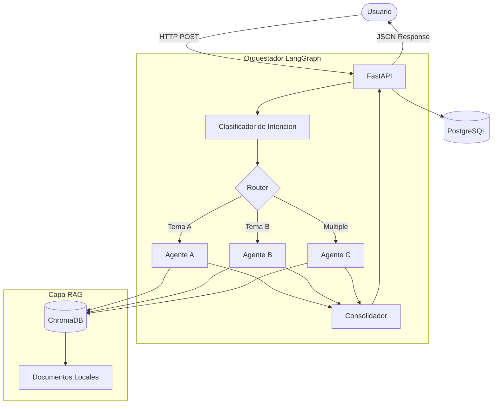
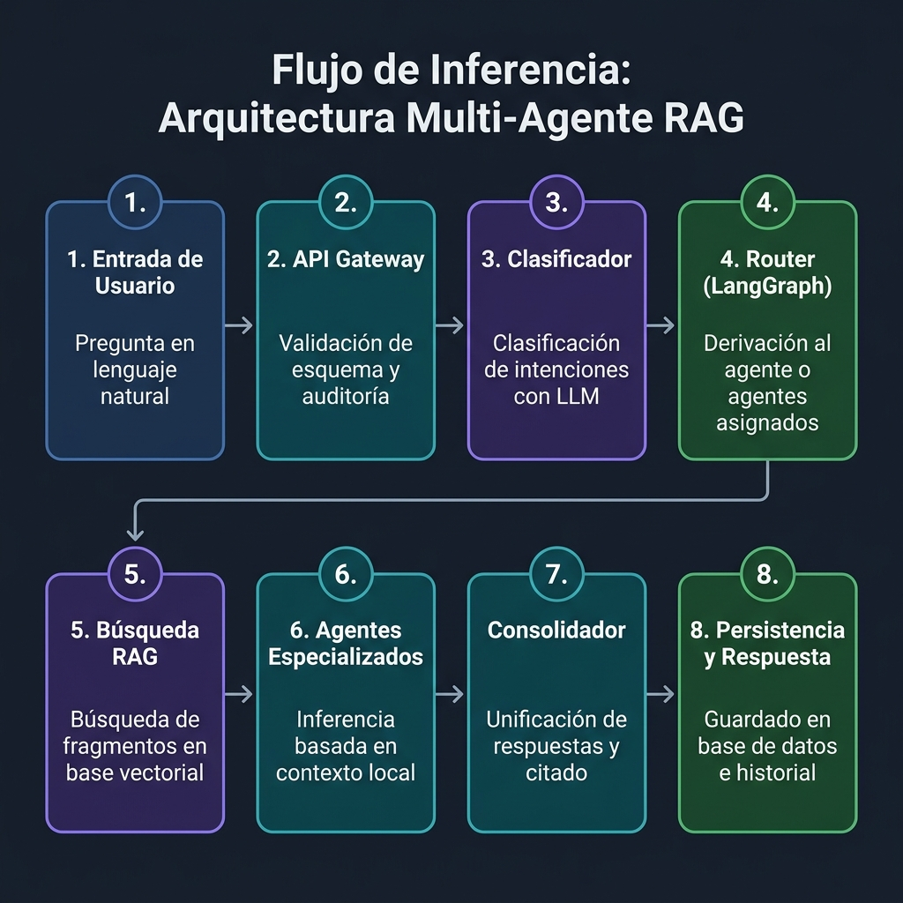

# Caso Práctico Semillero IA

---

## Tabla de contenido

* [Stack Tecnológico](#stack-tecnológico)
* [Arquitectura](#arquitectura)
* [Estructura del Proyecto](#estructura-del-proyecto)
* [Cómo empezar](#-cómo-empezar)
* [Ejecutar el Proyecto](#-ejecutar-el-proyecto)
* [Pruebas](#-pruebas)
* [Endpoints de la API](#endpoints-de-la-api)
* [Ingesta de Documentos](#-ingesta-de-documentos)
* [Decisiones Técnicas](#decisiones-técnicas)

---

## Stack Tecnológico

### Backend 
[](https://fastapi.tiangolo.com/)
[](https://www.python.org/)
[](https://www.langchain.com/)
[](https://langchain-ai.github.io/langgraph/)
[](https://www.trychroma.com/)
[](https://aistudio.google.com/)
[](https://www.postgresql.org/)
[](https://www.sqlalchemy.org/)
[](https://alembic.sqlalchemy.org/)
[](https://www.docker.com/)

### Frontend (Interfaz de Chat Premium)
[](https://nextjs.org/)
[](https://www.typescriptlang.org/)
[](https://tailwindcss.com/)
[](https://ui.shadcn.com/)

### Justificación de Tecnologías Clave

| Componente | Elección | Por qué |
| :--- | :--- | :--- |
| **Lenguaje** | Python 3.11 | Estándar empresarial para IA / RAG. Ecosistema robusto de NLP. |
| **Web framework** | FastAPI + uvicorn | Tipado estricto, documentación automática (Swagger), alto rendimiento asíncrono. |
| **Orquestación** | LangGraph 0.4 | Permite modelar el flujo de agentes como un grafo explícito (State Graph), ideal para enrutamiento condicional y flujos cíclicos. |
| **Vector store** | ChromaDB (local) | Persistente, rápido de configurar y no requiere servicios externos para el prototipo. |
| **Base de Datos** | PostgreSQL + SQLAlchemy | Almacenamiento robusto y estructurado para historial de conversaciones y auditoría. |
| **LLM & Embeddings** | Google Gemini 1.5 Flash / embeddings-004 | Alta velocidad de inferencia, excelente ventana de contexto, ideal para agentes. |
| **Frontend UI** | Next.js + Tailwind + Shadcn UI | Desarrollo ágil con componentes pre-estilizados de alta calidad y SSR/CSR híbrido. |

---

## Arquitectura

El sistema sigue una arquitectura de microservicios separando el frontend del backend, con un flujo interno orquestado por LangGraph.

### Diagrama de alto nivel

```text
Browser ──► Web UI (Next.js)  │  TypeScript + Tailwind + Shadcn
                │
                ▼
         HTTP (POST /api/v1/chat, GET /api/v1/health)
                │
                ▼
┌───────────────────────────────────────────────────┐
│  FastAPI                                          │
│  app.main  ──►  api/v1/router  ──►  endpoints     │
│                                                   │
│  ┌─────────────────────────────────────────────┐  │
│  │  LangGraph StateGraph (orchestrator.py)     │  │
│  │                                             │  │
│  │  START                                      │  │
│  │   ├► classify  (Clasificador, LLM temp=0)   │  │
│  │   │    ├► agente_1 ──┐                      │  │
│  │   │    ├► agente_2 ──┤──► consolidate ► END │  │
│  │   │    ├► agente_N ──┘                      │  │
│  │   │    └► mixta (N agentes)                 │  │
│  └─────────────────────────────────────────────┘  │
│                     │                             │
│                     ▼                             │
│           ChromaDB (colección por agente)          │
│           Retriever + Embeddings Gemini            │
│                                                   │
│           PostgreSQL (historial + auditoría)       │
└───────────────────────────────────────────────────┘
```

### Diagrama de flujo detallado



### Flujo de Inferencia Paso a Paso

A continuación se presenta el flujo detallado de inferencia y procesamiento secuencial de una consulta dentro de la arquitectura de agentes RAG del proyecto:



---

## Estructura del Proyecto

```text
Caso_Practico_Semillero_IA/
├── backend/                        # Núcleo de servicios, RAG y agentes IA (Python/FastAPI)
│   ├── alembic/                    # Gestión de migraciones de base de datos
│   ├── app/                        # Aplicación principal
│   │   ├── agents/                 # Agentes especializados y clase base
│   │   ├── api/v1/endpoints/       # Rutas REST: Chat, Documents, Health
│   │   ├── core/                   # Orquestador LangGraph, cliente LLM y excepciones
│   │   ├── db/                     # Sesión de base de datos relacional
│   │   ├── models/                 # Modelos ORM (Conversaciones, Mensajes, Auditoría)
│   │   ├── prompts/                # System prompts para cada agente y clasificador
│   │   ├── rag/                    # Pipeline RAG: Loader, Splitter, Embeddings, Retriever, Vectorstore
│   │   ├── repositories/           # Capa de acceso a datos para PostgreSQL
│   │   ├── schemas/                # DTOs de Pydantic v2 (ChatRequest, AgentResult)
│   │   ├── services/               # Lógica de negocio (ChatService)
│   │   └── utils/                  # Logging estructurado (structlog) y métricas
│   ├── data/                       # Almacenamiento de documentos crudos y persistencia ChromaDB
│   ├── scripts/                    # Scripts de indexación de documentos y pruebas
│   └── tests/                      # Pruebas unitarias, de integración y end-to-end
├── frontend/                       # Interfaz de chat (Next.js 14 + TypeScript)
│   ├── app/                        # App Router y estilos globales
│   ├── components/chat/            # Componentes del chat (ChatWindow, MessageBubble, InputBox)
│   ├── hooks/                      # Hooks para gestión de estado del chat
│   ├── lib/                        # Clientes de API y utilidades
│   ├── tests/                      # Pruebas de interfaz
│   └── types/                      # Interfaces TypeScript reflejando los schemas del backend
├── docs/                           # Documentación técnica, ADRs, riesgos y guías
├── .github/workflows/              # Flujos de CI/CD de GitHub Actions
├── docker-compose.yml              # Orquestación de infraestructura local
├── docker-compose.override.yml     # Configuraciones específicas para desarrollo local
├── Makefile                        # Atajos para comandos de desarrollo y pruebas
├── LICENSE                         # Licencia MIT
├── *.md                            # Documentos de control (AGENTS.md, STATUS.md, WORKFLOW.md, etc.)
└── README.md                       # Documentación maestra del sistema
```

### 📂 ¿Qué hace cada carpeta a detalle?

**1. Núcleo del Backend (`backend/app/`)**
- **`agents/`**: Aquí viven las clases concretas de cada agente experto (Arquitectura, Seguridad, etc.). Heredan de una base común y cada uno busca solo en su propia colección de documentos para evitar cruzar información.
- **`core/`**: Es el motor de la inteligencia. Contiene `orchestrator.py` (el grafo de LangGraph que decide quién habla), `classifier.py` (Gemini decidiendo la intención del usuario) y la conexión global al LLM.
- **`rag/`**: Contiene la lógica pura de ingesta y búsqueda vectorial. Tiene scripts para cargar PDFs/TXTs, partirlos en trozos lógicos (`splitter.py`) y buscarlos semánticamente en ChromaDB (`retriever.py`).
- **`api/v1/`**: Define las rutas (endpoints) que expone FastAPI. Aquí es donde el Frontend envía las peticiones HTTP (`/chat`, `/health`).
- **`models/` & `repositories/`**: Abstracciones para conectar y guardar en PostgreSQL el historial de chats y el registro de auditoría. 

**2. Interfaz de Usuario (`frontend/`)**
- **`app/`**: Utiliza el "App Router" de Next.js. Define la estructura HTML de la página, el layout global y los estilos base (`globals.css`).
- **`components/chat/`**: Contiene los bloques visuales de React. Por ejemplo, `MessageBubble.tsx` pinta lo que dice el agente y `SourcesBadge.tsx` pinta los botoncitos con los documentos citados.
- **`hooks/`**: (`useChat.ts`) Toda la lógica pesada de React está separada aquí. Maneja el estado de si la IA "está escribiendo", la lista de mensajes y los errores de red, manteniendo los componentes visuales limpios.
- **`types/`**: Contratos en TypeScript que son espejos exactos de los esquemas (Pydantic) del Backend, garantizando que el Frontend no falle al leer respuestas JSON.

**3. Documentación y Control (`docs/`)**
- Son los "Steering Docs". En vez de dejar la arquitectura a la imaginación, aquí se documenta formalmente la calidad del código (`CODE_QUALITY.md`), cómo armar los prompts (`PROMPTS.md`) y las decisiones técnicas (`DECISIONS.md`). Son leídos tanto por desarrolladores humanos como por agentes IA locales para mantener el contexto del repositorio.

---

## 🚀 Cómo empezar

### 1. Clonar el repositorio
```bash
git clone https://github.com/geremyjampiersalasgarcia-eng/Caso_Practico_Semillero_IA.git
cd Caso_Practico_Semillero_IA
```

### 2. Configurar Variables de Entorno (IMPORTANTE)

El proyecto utiliza variables de entorno para manejar credenciales de forma segura. **NUNCA** debes subir tus API keys al repositorio.

**Para el Backend:**
1. Navega a la carpeta del backend:
   ```bash
   cd backend
   ```
2. Copia el archivo de ejemplo para crear tu propio archivo `.env` local:
   ```bash
   cp .env.example .env
   ```
   *(En Windows puedes usar `copy .env.example .env`)*
3. Abre el nuevo archivo `.env` en tu editor de código y agrega tu clave de Gemini:
   ```env
   GOOGLE_API_KEY=tu_api_key_aqui
   ```

**Para el Frontend:**
1. Navega a la carpeta del frontend:
   ```bash
   cd ../frontend
   ```
2. Crea tu archivo `.env.local`:
   ```bash
   cp .env.example .env.local
   ```

El archivo `.env` ya está excluido en el `.gitignore`, así que no hay riesgo de subirlo accidentalmente.

---

## 🐳 Ejecutar el Proyecto

### Opción A: Con Docker (Recomendado)
```bash
# Levantar todos los servicios de una sola vez
make up

# O si prefieres usar docker-compose directamente:
docker-compose up --build
```

| Servicio | URL | Descripción |
| :--- | :--- | :--- |
| Backend API | http://localhost:8000/docs | Swagger UI interactivo de FastAPI |
| Frontend UI | http://localhost:3000 | Interfaz de chat en el navegador |
| PostgreSQL | `localhost:5432` | Base de datos relacional |

### Opción B: Sin Docker (Desarrollo Local en Windows/Linux)
```bash
# 1. Levantar el Backend
cd backend
# Crear y activar entorno virtual
python -m venv venv
# (En Windows: .\venv\Scripts\activate | En Linux/Mac: source venv/bin/activate)
.\venv\Scripts\activate
pip install -r requirements.txt
# (Nota: Si PostgreSQL no está corriendo, el sistema usará automáticamente una BD local SQLite como fallback)
python -m uvicorn app.main:app --reload --host 0.0.0.0 --port 8000

# 2. Levantar el Frontend (en otra terminal)
cd frontend
npm install
npm run dev
```

### Atajos con Makefile
El proyecto incluye un `Makefile` con atajos para las operaciones más comunes:

| Comando | Acción |
| :--- | :--- |
| `make up` | Levanta todo con Docker Compose |
| `make down` | Detiene todos los contenedores |
| `make test` | Ejecuta toda la suite de pruebas |
| `make ingest` | Indexa los documentos en ChromaDB |
| `make lint` | Ejecuta linters (black, flake8) |

---

## 🧪 Pruebas

```bash
# Ejecutar todas las pruebas del backend
cd backend && pytest -v --cov=app

# Solo pruebas unitarias
pytest tests/unit/ -v

# Solo pruebas de integración
pytest tests/integration/ -v

# Solo pruebas end-to-end
pytest tests/e2e/ -v

# Pruebas del frontend
cd frontend && npm test
```

Se espera un mínimo de **80% de cobertura** de líneas en el backend.

---

## Endpoints de la API

| Método | Endpoint | Descripción |
| :--- | :--- | :--- |
| `POST` | `/api/v1/chat` | Envía un mensaje al orquestador de agentes y devuelve la respuesta consolidada con fuentes. |
| `GET` | `/api/v1/conversations` | Lista el historial de todas las conversaciones guardadas en la base de datos. |
| `GET` | `/api/v1/conversations/{id}` | Carga el detalle completo (mensajes y fuentes) de una conversación pasada. |
| `DELETE` | `/api/v1/conversations/{id}` | Elimina una conversación de manera permanente. |
| `GET` | `/api/v1/health` | Verifica el estado del servicio y conexión a BD/ChromaDB. |
| `GET` | `/api/v1/documents` | Lista los documentos indexados en el sistema RAG. |

---

## 📥 Ingesta de Documentos

La indexación de documentos en ChromaDB se realiza mediante un script offline (no es un endpoint en caliente):

```bash
# Indexar todos los documentos de data/raw/ en ChromaDB
make ingest

# O directamente:
python scripts/ingest.py
```

**Flujo de ingesta:**
1. `loader.py` lee los archivos TXT/PDF de `data/raw/`
2. `splitter.py` los divide en fragmentos optimizados (chunks de ~1000 caracteres)
3. `embeddings.py` genera los vectores con Gemini `gemini-embedding-2`
4. `vectorstore.py` almacena los vectores en la colección correspondiente de ChromaDB

> **Nota:** Para agregar nuevos documentos, simplemente colócalos en `data/raw/` y re-ejecuta `make ingest`.

---

## Decisiones Técnicas

* **Arquitectura Clean/Hexagonal**: Se han separado las capas de presentación (`api`), negocio (`services`/`core`/`agents`), y acceso a datos (`rag`/`repositories`).
* **Patrón de Registro de Agentes (Registry)**: Permite inyectar nuevos agentes especializados sin modificar el código base del orquestador.
* **Trazabilidad Pura**: Cada respuesta incluye un bloque de `sources` que detalla qué agente intervino, qué documento consultó y qué sección exacta extrajo, mitigando alucinaciones.