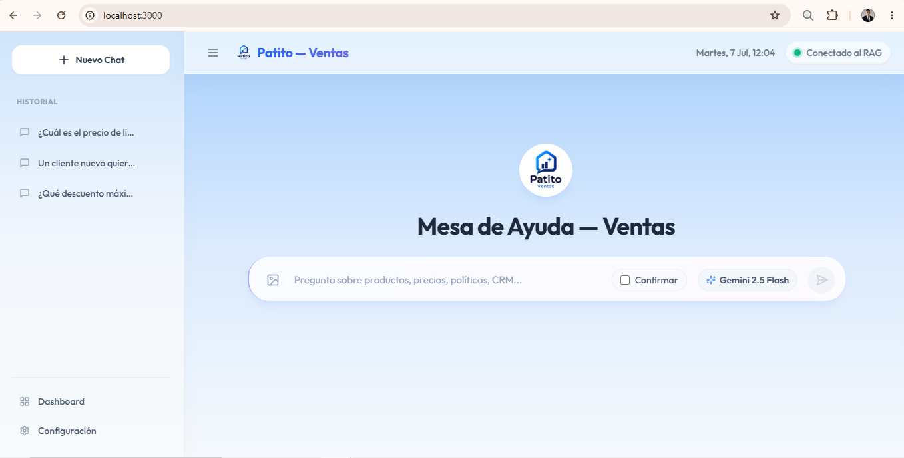
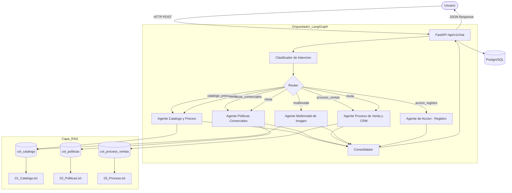

# Patito S.A.
## Departamento de Ventas
### Proyecto final del semillero

**Grupo:** Net Ingenieros

> **Sistema de Inteligencia Artificial Avanzado** con agentes especializados para potenciar la mesa de ayuda del equipo comercial.

Este proyecto consiste en un sistema de Inteligencia Artificial diseñado para asistir al Departamento de Ventas de la empresa ficticia Patito S.A. Utiliza una arquitectura Multi-Agente basada en LangGraph y procesamiento RAG (Retrieval-Augmented Generation) con ChromaDB y Google Gemini, permitiendo a los vendedores consultar información precisa sobre el catálogo de productos, precios, políticas comerciales y registrar oportunidades en el CRM mediante lenguaje natural o análisis de imágenes.



> 🎬 **[Ver video de demostración de la interfaz](docs/video/video-demostracion.mp4)** *(clic en "View raw" para reproducir)*

---

## Tabla de contenido

* [Stack Tecnológico](#stack-tecnológico)
* [Arquitectura](#arquitectura)
* [Agentes del Sistema](#agentes-del-sistema)
* [Estructura del Proyecto](#estructura-del-proyecto)
* [Cómo empezar](#-cómo-empezar)
* [Ingesta de Documentos](#-ingesta-de-documentos)
* [Ejecutar el Proyecto](#-ejecutar-el-proyecto)
* [Ejemplos de Uso](#-ejemplos-de-uso)
* [Decisiones Técnicas](#decisiones-técnicas)
* [Riesgos y Mejoras Futuras](#riesgos-y-mejoras-futuras)

---

## Stack Tecnológico

### Backend
[](https://fastapi.tiangolo.com/)
[](https://www.python.org/)
[](https://www.langchain.com/)
[](https://langchain-ai.github.io/langgraph/)
[](https://www.trychroma.com/)
[](https://aistudio.google.com/)
[](https://www.postgresql.org/)
[](https://www.sqlalchemy.org/)
[](https://docs.pydantic.dev/)
[](https://www.docker.com/)

### Frontend
[](https://nextjs.org/)
[](https://www.typescriptlang.org/)
[](https://tailwindcss.com/)
[](https://ui.shadcn.com/)

### Justificación de Tecnologías Clave

| Componente | Elección | Por qué |
| :--- | :--- | :--- |
| **Lenguaje** | Python 3.11 | Estándar para IA/NLP. Ecosistema robusto con LangChain y Google AI. |
| **Framework web** | FastAPI + Uvicorn | Tipado estricto, docs automáticas (Swagger), alto rendimiento asíncrono. |
| **Agentes** | LangChain | Framework estándar para agentes, tools y chains. Requerido por el semillero. |
| **Orquestación** | LangGraph (StateGraph) | Flujo de agentes como grafo explícito con enrutamiento condicional. |
| **Vector store** | ChromaDB (local) | Persistente, rápido, sin servicios externos. Una colección por agente. |
| **LLM & Embeddings** | Google Gemini (via `langchain-google-genai`) | `ChatGoogleGenerativeAI` para agentes, `GoogleGenerativeAIEmbeddings` para vectores. |
| **Visión** | Gemini Vision | Capacidad multimodal nativa para análisis de imágenes de productos. |
| **Base de datos** | PostgreSQL + Docker | Historial de conversaciones y auditoría robusta. |
| **Frontend** | Next.js + Tailwind + Shadcn UI | Interfaz de chat moderna y responsive. |

---

## Arquitectura

### Diagrama de alto nivel

```text
Browser ──► Web UI (Next.js)  │  TypeScript + Tailwind + Shadcn
                │
                ▼
         HTTP (POST /api/v1/chat)
                │
                ▼
┌───────────────────────────────────────────────────────────────┐
│  FastAPI  (app.main)                                          │
│                                                               │
│  ┌─────────────────────────────────────────────────────────┐  │
│  │  LangGraph StateGraph (orchestrator.py)                 │  │
│  │                                                         │  │
│  │  START                                                  │  │
│  │   └► classify (Gemini, temp=0)                          │  │
│  │       ├► catalogo_precios   → Agente Catálogo      ──┐  │  │
│  │       ├► politicas_comerc   → Agente Políticas     ──┤  │  │
│  │       ├► proceso_ventas     → Agente Proc. Ventas  ──┤  │  │
│  │       ├► multimodal         → Agente Imagen        ──┤  │  │
│  │       ├► accion_registro    → Agente Acción        ──┤  │  │
│  │       └► mixta              → 3 agentes RAG        ──┤  │  │
│  │                                                      │  │  │
│  │                                    consolidate ◄─────┘  │  │
│  │                                        │                │  │
│  │                                       END               │  │
│  └─────────────────────────────────────────────────────────┘  │
│                                                               │
│  ChromaDB (3 colecciones: col_catalogo, col_politicas,        │
│            col_proceso_ventas)                                │
│  PostgreSQL (historial + auditoría)                           │
└───────────────────────────────────────────────────────────────┘
```

### Diagrama de flujo (Mermaid)



### Flujo de Inferencia Paso a Paso

1. El usuario realiza una pregunta (opcionalmente adjunta imagen).
2. El **orquestador** recibe la pregunta.
3. El **clasificador** (Gemini con temp=0) determina la intención:
   - `catalogo_precios`, `politicas_comerciales`, `proceso_ventas`, `multimodal`, `accion_registro` o `mixta`.
4. Si hay imagen adjunta → se redirige automáticamente al **agente multimodal**.
5. Si se detecta solicitud de registro → se redirige al **agente de acción**.
6. Se invoca uno o más **agentes especializados** (LangChain).
7. Cada agente consulta su **base de conocimiento embebida** (retriever sobre ChromaDB).
8. Cada agente genera una respuesta parcial con fuentes citadas.
9. El **consolidador** integra las respuestas en una sola coherente.
10. El sistema retorna: **respuesta final**, **agentes participantes**, **fuentes utilizadas** y **advertencias** (si aplica).

---

## Agentes del Sistema

### 1. Agente de Catálogo y Precios (`agente_catalogo`)
- **Función:** Productos, especificaciones, precios de lista, disponibilidad.
- **Base de conocimiento:** `01_Catalogo_Productos_Precios.txt` → `col_catalogo`
- **Ejemplo:** *"¿Cuál es el precio de lista y la disponibilidad del producto Patito Pro 2026?"*

### 2. Agente de Políticas Comerciales (`agente_politicas`)
- **Función:** Descuentos, niveles de autorización, crédito, garantías, devoluciones.
- **Base de conocimiento:** `02_Politicas_Comerciales_Descuentos_Credito.txt` → `col_politicas`
- **Ejemplo:** *"¿Qué descuento máximo puedo ofrecer a un cliente nuevo sin aprobación del gerente?"*

### 3. Agente de Proceso de Venta y CRM (`agente_proceso_ventas`)
- **Función:** Etapas del embudo, registro en CRM, requisitos para cerrar ventas.
- **Base de conocimiento:** `03_Proceso_Ventas_CRM.txt` → `col_proceso_ventas`
- **Ejemplo:** *"¿Qué información debo registrar en el CRM antes de marcar una oportunidad como ganada?"*

### 4. Agente Multimodal de Imagen (`agente_multimodal`)
- **Función:** Analiza imágenes de productos con Gemini Vision y cruza con el catálogo.
- **Base de conocimiento:** Cruza con `col_catalogo`
- **Ejemplo:** *"Adjunto la foto de un producto: ¿cuál es, cuál es su precio de lista y está disponible?"*

### 5. Agente de Acción — Registro (`agente_accion`)
- **Función:** Registra oportunidades/cotizaciones en `registro_oportunidades.txt`.
- **Validación:** Cliente, contacto, producto, cantidad, precio con descuento, condición de pago, monto total.
- **Control:** Si falta algún dato → lo solicita. Si descuento > 10% → advierte autorización. Pide confirmación antes de escribir.
- **Ejemplo:** *"Registra una oportunidad: cliente Comercial ABC, 10 unidades de Patito Pro 2026, 8% de descuento, pago de contado."*

---

## Estructura del Proyecto

```text
Caso_Practico_Semillero_IA/
├── backend/                              # Backend Python / FastAPI
│   ├── app/
│   │   ├── agents/                       # Agentes especializados
│   │   │   ├── base_agent.py             # Clase base (RAG + LLM)
│   │   │   ├── catalogo_agent.py         # Agente de Catálogo y Precios
│   │   │   ├── politicas_agent.py        # Agente de Políticas Comerciales
│   │   │   ├── proceso_ventas_agent.py   # Agente de Proceso de Venta y CRM
│   │   │   ├── multimodal_agent.py       # Agente Multimodal de Imagen
│   │   │   ├── accion_agent.py           # Agente de Acción (Registro)
│   │   │   ├── registry.py              # Patrón Registry
│   │   │   └── __init__.py              # Registro de todos los agentes
│   │   ├── core/                         # Motor de IA
│   │   │   ├── orchestrator.py           # LangGraph StateGraph (orquestador)
│   │   │   ├── classifier.py            # Clasificador de intención (Gemini)
│   │   │   └── llm.py                   # Cliente Gemini (LLM + Embeddings)
│   │   ├── prompts/                      # System prompts (Markdown)
│   │   │   ├── catalogo_prompt.md
│   │   │   ├── politicas_prompt.md
│   │   │   ├── proceso_ventas_prompt.md
│   │   │   ├── multimodal_prompt.md
│   │   │   ├── accion_prompt.md
│   │   │   ├── classifier_prompt.md
│   │   │   └── orchestrator_prompt.md
│   │   ├── rag/                          # Pipeline RAG
│   │   │   ├── loader.py                # Carga TXT/PDF
│   │   │   ├── splitter.py              # Chunking (RecursiveCharacterTextSplitter)
│   │   │   ├── embeddings.py            # GoogleGenerativeAIEmbeddings
│   │   │   ├── retriever.py             # Búsqueda semántica en ChromaDB
│   │   │   └── vectorstore.py           # Gestión de colecciones ChromaDB
│   │   ├── api/v1/                       # Endpoints REST
│   │   ├── services/                     # Lógica de negocio (ChatService)
│   │   ├── models/                       # ORM (Conversaciones, Auditoría)
│   │   ├── schemas/                      # DTOs Pydantic v2
│   │   └── utils/                        # Logging (structlog)
│   ├── data/
│   │   ├── raw/                          # Documentos base de conocimiento
│   │   │   ├── 01_Catalogo_Productos_Precios.txt
│   │   │   ├── 02_Politicas_Comerciales_Descuentos_Credito.txt
│   │   │   └── 03_Proceso_Ventas_CRM.txt
│   │   ├── chroma_db/                    # Persistencia ChromaDB
│   │   └── registro_oportunidades.txt    # Archivo de registro del agente de acción
│   ├── scripts/
│   │   └── ingest.py                    # Script de ingesta por colección
│   ├── tests/                            # Pruebas
│   ├── .env.example                      # Template de variables de entorno
│   └── requirements.txt                  # Dependencias Python
├── frontend/                             # Interfaz Next.js + TypeScript
│   ├── app/                              # Páginas principales y Layouts (App Router)
│   ├── components/                       # Componentes React (UI, ChatInput, etc.)
│   ├── hooks/                            # Custom hooks (e.g., useChat.ts)
│   ├── lib/                              # Lógica de API (conexión con FastAPI)
│   ├── types/                            # Definiciones de interfaces TypeScript
│   ├── tailwind.config.ts                # Configuración de estilos CSS
│   └── package.json                      # Dependencias de Node.js
├── docs/                                 # Documentación técnica
├── docker-compose.yml                    # PostgreSQL con Docker
├── AGENTS.md                             # Definición de agentes
└── README.md                             # Este archivo
```

### Descripción de Directorios

- **`backend/`**: Contiene todo el núcleo de Inteligencia Artificial y el servidor (FastAPI).
  - **`app/agents/`**: Aquí residen los "cerebros" individuales. Cada archivo define a un agente especialista (Catálogo, Políticas, Acción, etc.) y su respectivo comportamiento.
  - **`app/core/`**: Contiene el motor principal basado en LangGraph (`orchestrator.py`), que actúa como el jefe que recibe la pregunta, la clasifica (`classifier.py`) y dirige el tráfico hacia los agentes adecuados.
  - **`app/rag/`**: Módulos responsables de leer los archivos de texto, dividirlos, generar sus vectores (embeddings) con Gemini y conectarse a ChromaDB.
  - **`data/`**: Carpeta de almacenamiento local. Guarda los documentos de texto originales (`raw/`), la base de datos vectorial generada (`chroma_db/`) y el archivo de salida de cotizaciones (`registro_oportunidades.txt`).
  - **`scripts/`**: Scripts de utilidad, destacando `ingest.py`, el cual debe ejecutarse por primera vez para poblar el conocimiento de los agentes.
- **`frontend/`**: La interfaz de usuario moderna desarrollada en React/Next.js. Maneja la comunicación con el backend, el renderizado de los mensajes, el historial de chats y el diseño visual con TailwindCSS.
- **`docs/`**: Destinada a almacenar diagramas, capturas de pantalla y documentación complementaria del proyecto.

---

## 🛠️ Requisitos Previos

Para ejecutar y explorar este proyecto en tu entorno local, se recomienda contar con las siguientes herramientas:

- **Editor de Código:** [Visual Studio Code](https://code.visualstudio.com/) (o similar) indispensable para editar los archivos, configurar el archivo `.env` fácilmente y utilizar la terminal integrada.
- **Python 3.11+** (Para ejecutar el backend y los agentes de IA).
- **Node.js y npm** (Para levantar la interfaz gráfica del frontend).
- **Docker Desktop** (Opcional, pero recomendado para levantar la base de datos PostgreSQL con un solo comando).

---

## 🚀 Cómo empezar

### 1. Clonar el repositorio

```bash
git clone https://github.com/geremyjampiersalasgarcia-eng/Caso_Practico_Semillero_IA.git
cd Caso_Practico_Semillero_IA
```

### 2. Configurar Variables de Entorno (IMPORTANTE)

**La GOOGLE_API_KEY es obligatoria** para que funcionen los agentes, embeddings y el clasificador.

```bash
cd backend
cp .env.example .env
# En Windows: copy .env.example .env
```

Abre el archivo `.env` y pega tu clave de Google Gemini:

```env
GOOGLE_API_KEY=tu_api_key_aqui
```

> 💡 **Obtén tu API Key gratuita en:** [https://aistudio.google.com/apikey](https://aistudio.google.com/apikey)

El archivo `.env` está excluido en `.gitignore` — no hay riesgo de subir tu clave a GitHub.

### 3. Instalar dependencias de Python

```bash
cd backend
python -m venv venv
.\venv\Scripts\activate       # Windows
# source venv/bin/activate    # Linux/Mac
pip install -r requirements.txt
```

---

## 📥 Ingesta de Documentos

**Este paso es obligatorio antes de usar el sistema.** Genera los embeddings e índices vectoriales por agente.

```bash
cd backend
python scripts/ingest.py
```

**Flujo de ingesta:**

1. `loader.py` lee los 3 archivos TXT de `data/raw/`
2. `splitter.py` los divide en chunks de ~1000 caracteres con 200 de overlap (RecursiveCharacterTextSplitter)
3. `embeddings.py` genera vectores con `GoogleGenerativeAIEmbeddings` (modelo `models/gemini-embedding-2`)
4. `vectorstore.py` almacena cada documento en **su propia colección** ChromaDB:

| Documento | Colección ChromaDB |
|:---|:---|
| `01_Catalogo_Productos_Precios.txt` | `col_catalogo` |
| `02_Politicas_Comerciales_Descuentos_Credito.txt` | `col_politicas` |
| `03_Proceso_Ventas_CRM.txt` | `col_proceso_ventas` |

> **Nota:** Para re-indexar, simplemente ejecuta `python scripts/ingest.py` de nuevo. El script limpia las colecciones antes de re-indexar.

---

## 🐳 Ejecutar el Proyecto

> [!WARNING]
> **ORDEN ESTRICTO DE EJECUCIÓN**
> Para evitar errores de conexión o fallos silenciosos, los servicios **DEBEN** levantarse en la siguiente secuencia exacta:
> 1. **Docker (PostgreSQL)** → Esperar a que el contenedor esté *Healthy* (listo para conexiones), no solo *Running*.
> 2. **Backend (FastAPI)** → Levantar el servidor Uvicorn.
> 3. **Ingesta de datos (`ingest.py`)** → Ejecutar *después* de que la BD esté lista.
> 4. **Frontend (Next.js)** → Último paso.
> 
> *Nota común:* Si ejecutas `docker-compose up -d`, la consola te devuelve el control casi al instante, pero Postgres tarda unos segundos más en aceptar conexiones reales. Asegúrate de esperar un momento antes de encender el backend.

### Paso 1: Levantar la Base de Datos (con Docker)

> [!NOTE]
> Asegúrate de tener [Docker Desktop](https://www.docker.com/products/docker-desktop/) instalado y corriendo.

```bash
# Asegúrate de estar en la carpeta raíz principal (Caso_Practico_Semillero_IA)
# NO dentro de backend/ ni frontend/
docker-compose up -d postgres
```


### Paso 2: Levantar el Backend

```bash
cd backend
.\venv\Scripts\activate
python -m uvicorn app.main:app --reload --host 0.0.0.0 --port 8000
```

### Paso 3: Levantar el Frontend

```bash
cd frontend
npm install
npm run dev
```

### Servicios Activos

| Servicio | URL | Descripción |
| :--- | :--- | :--- |
| Backend API | http://localhost:8000/docs | Swagger UI interactivo |
| Frontend UI | http://localhost:3000 | Interfaz de chat |
| PostgreSQL | `localhost:5433` | Base de datos (vía Docker) |

---

## Endpoints de la API

| Método | Endpoint | Descripción |
| :--- | :--- | :--- |
| `POST` | `/api/v1/chat` | Envía pregunta al orquestador. Acepta `question`, `image` (base64), `confirmation` (bool). |
| `GET` | `/api/v1/conversations` | Lista historial de conversaciones. |
| `GET` | `/api/v1/conversations/{id}` | Detalle de una conversación. |
| `DELETE` | `/api/v1/conversations/{id}` | Elimina una conversación. |
| `GET` | `/api/v1/health` | Estado del servicio. |
| `GET` | `/api/v1/documents` | Lista documentos indexados. |

### Ejemplo de request `POST /api/v1/chat`

```json
{
  "question": "¿Cuál es el precio del Patito Pro 2026?",
  "conversation_id": null,
  "image": null,
  "confirmation": null
}
```

### Ejemplo con imagen (agente multimodal):

```json
{
  "question": "¿Qué producto es este y cuánto cuesta?",
  "image": "data:image/jpeg;base64,/9j/4AAQ..."
}
```

### Ejemplo con registro (agente de acción):

```json
{
  "question": "Registra una oportunidad: cliente Comercial ABC, 10 unidades Patito Pro 2026, 8% descuento, contado",
  "confirmation": true
}
```

---

## 💬 Ejemplos de Uso

### Consulta de Catálogo
**Pregunta:** *¿Cuál es el precio de lista y la disponibilidad del producto Patito Pro 2026?*

**Respuesta esperada:** El Patito Pro 2026 tiene un precio de lista de **USD 1,299**, está **EN STOCK** y cuenta con procesador de alto rendimiento, 16 GB RAM, 512 GB SSD. Incluye garantía estándar de 12 meses. (Fuente: Catálogo de Productos y Lista de Precios).

---

### Consulta de Políticas
**Pregunta:** *¿Qué descuento máximo puedo ofrecer a un cliente nuevo sin aprobación del gerente?*

**Respuesta esperada:** Hasta **10%** de descuento. El vendedor puede autorizarlo directamente sin aprobación adicional. (Fuente: Políticas Comerciales).

---

### Consulta de Proceso de Venta
**Pregunta:** *¿Qué información debo registrar en el CRM antes de marcar una oportunidad como ganada?*

**Respuesta esperada:** Orden de compra/contrato firmado, datos de facturación, productos/cantidades/precios finales, condición de pago, monto total, fecha de cierre y fecha de entrega comprometida. (Fuente: Manual del Proceso de Ventas y CRM).

---

### Consulta Mixta
**Pregunta:** *Un cliente nuevo quiere comprar 50 unidades del Patito Pro 2026 a crédito y pide un descuento especial. ¿Cuál es el precio, qué descuento y condiciones de crédito puedo ofrecer, y qué debo registrar en el CRM?*

**Agentes participantes:** Catálogo + Políticas + Proceso Ventas (mixta)

**Respuesta esperada:** Integra precio del Patito Pro 2026 (USD 1,299), que el descuento hasta 10% lo autoriza el vendedor (más requiere gerente), que clientes nuevos normalmente pagan de contado la primera compra (crédito requiere análisis), y los datos que deben registrarse en el CRM antes del cierre.

---

### Registro de Oportunidad (Flujo Multi-paso)
**Ejemplos de Preguntas Iniciales de Prueba:** 
1. *Registra una oportunidad: cliente Comercial ABC, 10 unidades de Patito Pro 2026, 8% de descuento, pago de contado.*
2. *Quiero registrar una venta para la Empresa XYZ. Van a comprar 5 unidades a $50 dólares cada una con pago a crédito de 30 días.*
3. *Guarda en el CRM una oportunidad para el cliente Hospital San José, el contacto es María, son 20 licencias.*
4. *Necesito registrar a Tech Solutions, contacto Luis, compraron 100 unidades del Patito Basic al contado con 5% de descuento, el precio base era $10.*

**Agente:** Acción

**Flujo esperado (Ejemplo con la pregunta 1):**
1. El agente detecta que faltan datos obligatorios según las reglas del CRM.
2. **Respuesta del agente:** *Pide el nombre del contacto y el precio unitario original.*
3. **Usuario responde:** *Contacto: Geremy, el precio es $23.*
4. **Respuesta del agente:** Presenta resumen con datos calculados (precio con descuento: $21.16, monto total: $211.60) y pide confirmación.
5. **Usuario responde:** *Sí, registrar.*
6. **Acción final:** Se ejecuta la herramienta (Function Calling) y genera un registro con ID único (ej. OPP-20260706-A3F2B1) en `data/registro_oportunidades.txt`.

---

## 📎 Archivos de Prueba (Entregables)

### Imagen de prueba para el Agente Multimodal
Para probar el agente multimodal de imagen, se incluyen imágenes de prueba en el repositorio:

```
docs/images/producto.webp
docs/images/artículo2.jpg
```

**Cómo usarla:** En la interfaz web, haz clic en el ícono de adjuntar imagen (📎), selecciona el archivo `producto.webp` y escribe una pregunta como:
> *"¿Qué producto es este? ¿Está en el catálogo y cuánto cuesta?"*

### Archivo de registro del Agente de Acción
El agente de acción genera registros en el siguiente archivo:

```
backend/data/registro_oportunidades.txt
```

Este archivo se crea automáticamente cuando el usuario confirma el registro de una oportunidad. Cada registro incluye un identificador único (ej. `OPP-20260705-A3F2B1`), fecha/hora y todos los datos de la oportunidad.

Además, para garantizar persistencia, **cada oportunidad se inserta simultáneamente en la tabla `oportunidades` de la base de datos PostgreSQL**, garantizando redundancia y capacidad de consultas estructuradas en el futuro.

---

## Decisiones Técnicas

### Arquitectura de Software vs. Jupyter Notebook
A diferencia de enfoques académicos que agrupan todo el código en un único archivo Jupyter Notebook, este proyecto fue diseñado deliberadamente como una **Arquitectura de Software Profesional y Escalable**, separando las responsabilidades en componentes (Frontend, Backend, Base de Datos, Vector Store). 

**¿Por qué se tomó esta decisión?**
1. **Realismo Empresarial:** En la industria, las soluciones de IA no se despliegan en notebooks. Se integran a través de APIs REST (FastAPI) y se consumen desde interfaces de usuario (React/Next.js) para que los usuarios no técnicos puedan interactuar con ellas.
2. **Modularidad y Mantenimiento:** Separar los agentes (`agents/`), la orquestación (`core/`) y la conexión a la base de datos (`rag/`, `db/`) permite que múltiples desarrolladores trabajen en paralelo sin conflictos, y facilita la escritura de pruebas unitarias.
3. **Persistencia Robusta:** Un notebook pierde su estado al reiniciarse. Este sistema utiliza PostgreSQL y ChromaDB montados en volúmenes para garantizar que el historial y la memoria de la empresa persistan de forma segura a lo largo del tiempo.
4. **Tolerancia a Fallos:** Se implementó un diseño tolerante a fallos donde si PostgreSQL (Docker) no está disponible, el sistema detecta la falla y hace un *fallback* automático a SQLite, garantizando la continuidad del servicio sin requerir intervención manual.

### Uso de LangChain en el Proyecto
El framework **LangChain** es el pilar de la solución de IA y se utiliza extensivamente en múltiples capas del sistema:
1. **Core LLM y Embeddings:** Se usan las clases `ChatGoogleGenerativeAI` y `GoogleGenerativeAIEmbeddings` del paquete `langchain-google-genai` para interactuar con Gemini (`app/core/llm.py`).
2. **Sistema de Mensajes:** Se emplea la estructura nativa de LangChain (`SystemMessage`, `HumanMessage`, `AIMessage`) para construir los prompts y el historial de conversación en todos los agentes (`app/agents/base_agent.py`).
3. **Pipeline RAG:** El procesamiento de documentos utiliza `RecursiveCharacterTextSplitter` para dividir el texto, y `Chroma` (de `langchain_chroma`) para la base de datos vectorial y las búsquedas semánticas (`app/rag/`).
4. **Function Calling (Herramientas):** En el agente de acción, se utiliza el decorador `@tool` de `langchain_core.tools` para convertir la función de Python `registrar_oportunidad_crm` en una herramienta que el LLM puede invocar (`app/agents/accion_agent.py`). Además, se usa `bind_tools()` para conectar la herramienta con Gemini.
5. **Orquestación avanzada:** El flujo completo de decisión y enrutamiento está construido sobre **LangGraph** (un framework construido sobre LangChain) usando la clase `StateGraph` (`app/core/orchestrator.py`).

### Uso de PostgreSQL y SQLite (Fallback)
El proyecto implementa una base de datos relacional (PostgreSQL) usando SQLAlchemy como ORM, empleada estrictamente para dos objetivos:
1. **Persistencia del Historial de Chat:** Guarda cada conversación (`Conversation`), los mensajes del usuario y las respuestas de los agentes (`Message`). Esto permite recuperar el contexto y mostrar el historial previo al usuario al recargar la página.
2. **Registro de Auditoría:** Guarda un log detallado (`AuditLog`) de cada petición procesada por el sistema. Registra la intención detectada, el agente que respondió, las fuentes utilizadas y el tiempo de latencia. *Nota: La base de conocimiento y los vectores no se guardan en PostgreSQL, sino en ChromaDB.*
(El sistema cuenta con un mecanismo de *fallback* a SQLite si el contenedor de PostgreSQL no está disponible).

### Estrategia de Chunking
- **Tamaño:** 1000 caracteres con 200 de overlap
- **Splitter:** `RecursiveCharacterTextSplitter` con separadores `["\n\n", "\n", ".", " "]`
- **Justificación:** Los documentos son cortos (~1000-1500 bytes cada uno), por lo que chunks de 1000 chars capturan secciones completas. El overlap de 200 asegura contexto entre chunks.

**Cómo se segmentan los archivos (Ejemplo de partición):**
Dado el tamaño de nuestros documentos originales, la fragmentación genera muy pocos *chunks* (fragmentos) por archivo, lo cual es ideal para mantener el contexto completo sin perder información.

| Documento | Tamaño Aprox. | N° de Chunks Generados | Contenido Principal del Chunk |
|:---|:---|:---:|:---|
| `01_Catalogo_Productos_Precios.txt` | ~1,200 chars | 2 chunks | **Chunk 1:** Productos principales (Smartphones).<br>**Chunk 2:** Resto de productos (Laptops) y notas. |
| `02_Politicas_Comerciales...txt` | ~1,000 chars | 1 o 2 chunks | Contiene casi toda la política de descuentos y créditos en un solo bloque cohesionado. |
| `03_Proceso_Ventas_CRM.txt` | ~1,400 chars | 2 chunks | **Chunk 1:** Prospección, calificación y propuesta.<br>**Chunk 2:** Negociación, cierre y registro en CRM. |

> **Nota sobre el Overlap (solapamiento):** Gracias al overlap de 200 caracteres, los últimos 200 caracteres del Chunk 1 se repiten al inicio del Chunk 2. Esto garantiza que si una regla o precio justo cae en la línea de corte, no se pierda el contexto para el LLM.

### Modelo de Embeddings
- **Modelo:** `models/gemini-embedding-2` (Google)
- **Justificación:** Requerido por el semillero. Alta calidad para texto en español.

### Modelo LLM
- **Modelo:** Configurable vía `LLM_MODEL_NAME` en `.env` (default: `gemini-1.5-flash`)
- **Temperatura:** 0.1 para agentes (baja alucinación), 0.0 para clasificador (determinismo)
- **Justificación:** Flash es rápido y económico para prototipo. Soporta visión multimodal.

### Retrieval (top-k)
- **top-k:** 4 fragmentos por consulta
- **Justificación:** Con documentos pequeños, 4 chunks cubren la mayoría del contenido relevante sin exceder el contexto.

### Vector Store
- **ChromaDB local** con persistencia en `data/chroma_db/`
- **Una colección por agente:** Aislamiento de bases de conocimiento
- **Justificación:** Simple, sin servicios externos, ideal para prototipo.

### Patrón de Agentes
- **Registry Pattern:** Permite agregar nuevos agentes sin modificar el orquestador
- **BaseAgent (ABC):** Clase base con flujo RAG estándar (retrieve → prompt → LLM → result)
- **Agentes especializados** heredan y solo definen: nombre, descripción, colección, prompt

### Orquestador con LangGraph
- **Elección:** `LangGraph (StateGraph)` en lugar de LangChain AgentExecutor clásico o un Router Chain simple.
- **Justificación:** LangGraph permite modelar el flujo de trabajo como un grafo de estados (StateGraph). Esto nos otorga un control total, predecible y determinista sobre el enrutamiento. En lugar de tener un solo agente tomando decisiones arbitrarias (que puede entrar en bucles infinitos o alucinar llamadas a herramientas), con LangGraph diseñamos una tubería estricta: primero se clasifica la intención (nodo `classify`), luego se toma una decisión de enrutamiento (nodo condicional), se ejecutan los agentes pertinentes (incluso en paralelo para consultas mixtas) y finalmente se consolida. Esto garantiza escalabilidad, reduce el consumo de tokens y facilita la integración del Agente de Acción y el Agente Multimodal.

---

## Riesgos y Mejoras Futuras

### Riesgos identificados

| Riesgo | Impacto | Mitigación actual |
|:---|:---|:---|
| Alucinación del LLM | Respuestas inventadas | Prompt estricto + temp baja + validación "no encontré información" |
| API Key expuesta | Seguridad | `.env` + `.gitignore` + `.env.example` sin credenciales |
| Documentos pequeños | Chunks redundantes | Ajuste de chunk_size. Monitorear calidad de retrieval |
| Costos de API Gemini | Consumo de tokens | Modelo Flash (económico), cacheo futuro |
| Concurrencia | Escritura simultánea en registro_oportunidades.txt | File lock o migrar a BD en producción |
| Latencia en consultas mixtas | 3 agentes + LLM consolidador | Ejecución paralela en LangGraph |

### Mejoras futuras

1. **Memoria conversacional:** Mantener contexto de la conversación entre turnos
2. **Streaming:** Respuestas parciales en tiempo real (SSE)
3. **Autenticación:** JWT/OAuth para controlar acceso por rol
4. **Permisos por agente:** Control de qué usuarios pueden acceder a qué agentes
5. **Monitoreo de calidad:** Dashboard con métricas de tokens, latencia, feedback
6. **Evaluación RAG:** Métricas de relevancia (RAGAS, faithfulness, answer relevancy)
7. **Cacheo de embeddings:** Evitar re-calcular embeddings para preguntas repetidas
8. **File lock para registros:** Evitar corrupción en escritura concurrente
9. **Historial de precios:** Versionar el catálogo por fechas
10. **Tests automatizados:** Aumentar cobertura con preguntas de golden set

---

## 🛠️ Troubleshooting (Solución de Problemas)

- **Error de conexión a Postgres al iniciar el backend:** Esperá 5-10 segundos después de ejecutar `docker-compose up -d postgres` antes de levantar el backend. El contenedor tarda unos instantes en inicializarse y estar listo para aceptar conexiones.
- **Error 429 de Gemini (Rate Limit):** Si usas la capa gratuita (free tier) de Google AI Studio, puedes alcanzar el límite de peticiones por minuto. Esperá unos segundos entre preguntas.
- **Error "collection not found" en ChromaDB:** Olvidaste correr el script de ingesta. Debes ejecutar `python scripts/ingest.py` dentro de la carpeta `backend` antes de levantar el servidor.

---

## Licencia

Proyecto académico — Semillero de Inteligencia Artificial.

---

<div align="center">
  <h3> Desarrollado por el equipo Net Ingenieros </h3>
  
  <p>
     <b>Frank Marcelo Villalta Díaz</b> <br>
     <b>Eddy Fernando Romo Quinde</b> <br>
     <b>Geremy Jampier Salas Garcia</b>
  </p>
  
  <br>
  <sub><i>Desarrollado con LangChain, LangGraph y Google Gemini</i></sub>
</div>