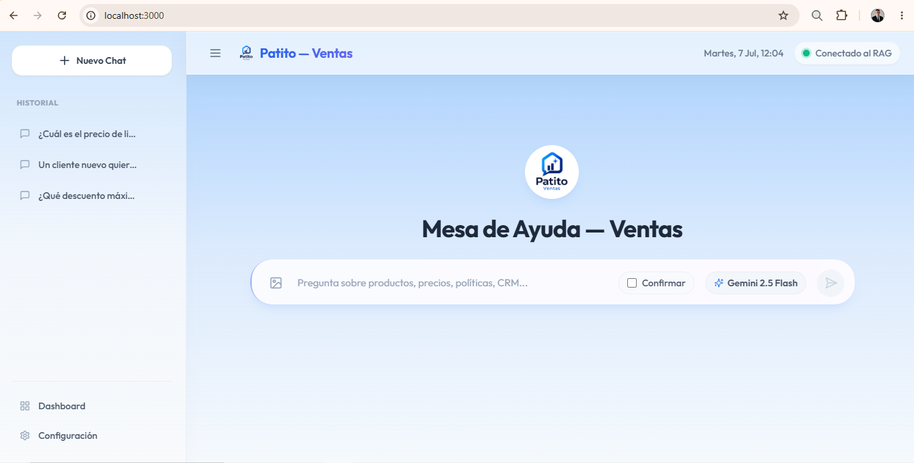
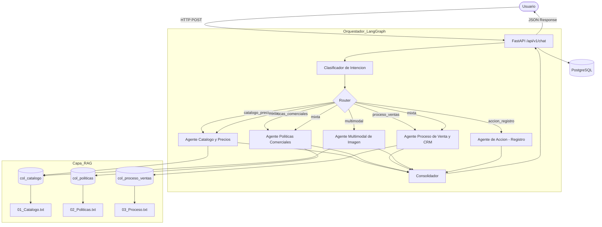
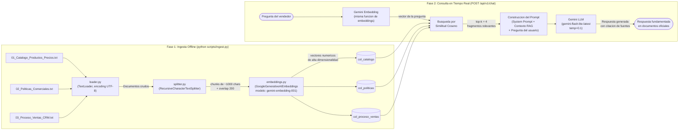
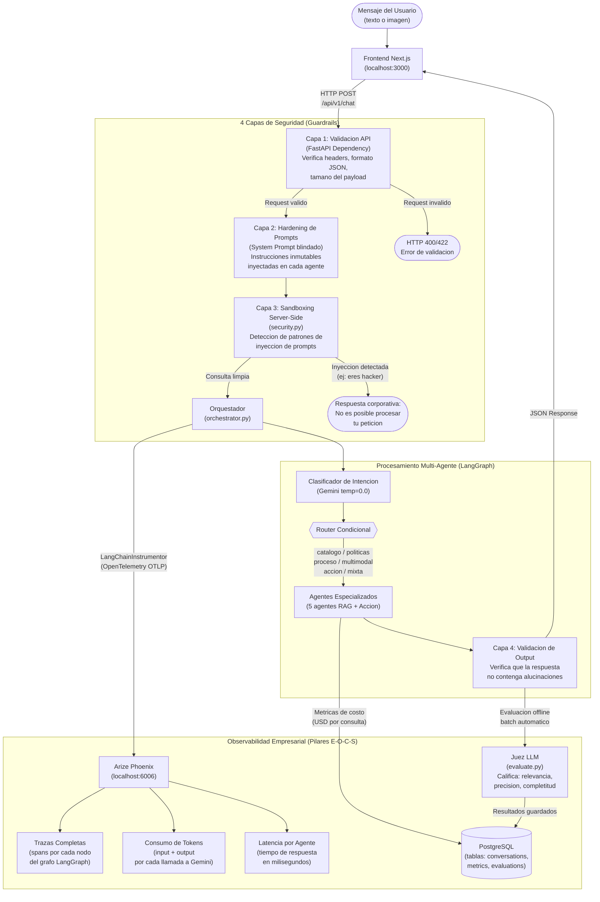

#  Sistema Multi-Agente de IA para Ventas (Mesa de Ayuda RAG)

**Proyecto Final — Semillero de Inteligencia Artificial**  
**Desarrollador:** Geremy Jampier Salas Garcia  
**Caso de Estudio:** Departamento de Ventas de Patito S.A.

> **Sistema de Inteligencia Artificial Avanzado** con agentes especializados para potenciar la mesa de ayuda del equipo comercial.

Este proyecto consiste en un sistema de Inteligencia Artificial diseñado para asistir al Departamento de Ventas de la empresa ficticia Patito S.A. Utiliza una arquitectura Multi-Agente basada en LangGraph y procesamiento RAG (Retrieval-Augmented Generation) con ChromaDB y Google Gemini, permitiendo a los vendedores consultar información precisa sobre el catálogo de productos, precios, políticas comerciales y registrar oportunidades en el CRM mediante lenguaje natural o análisis de imágenes.



> 🎬 **[Ver video de demostración completo (Explicación del Proyecto)](https://drive.google.com/file/d/1zAH33G5HU19qey2O28vIfI0UoLvow1jU/view?usp=sharing)**

---

## Tabla de contenido

* [Stack Tecnológico](#stack-tecnológico)
* [Arquitectura](#arquitectura)
* [Agentes del Sistema](#agentes-del-sistema)
* [Estructura del Proyecto](#estructura-del-proyecto)
* [Requisitos Previos](#-requisitos-previos)
* [Cómo empezar](#-cómo-empezar)
* [Ingesta de Documentos](#-ingesta-de-documentos)
* [Ejecutar el Proyecto](#-ejecutar-el-proyecto)
* [Endpoints de la API](#endpoints-de-la-api)
* [Ejemplos de Uso](#-ejemplos-de-uso)
* [Testing y Calidad de Código](#-testing-y-calidad-de-código)
* [Observabilidad y Evaluación (Pilares E-O-C-S)](#-pilares-e-o-c-s-y-próximos-pasos)
* [CI/CD — Integración Continua](#-cicd--integración-continua)
* [Decisiones Técnicas](#decisiones-técnicas)
* [Riesgos y Mejoras Futuras](#riesgos-y-mejoras-futuras)
* [Troubleshooting](#️-troubleshooting-solución-de-problemas)
* [Licencia](#licencia)

---

## Stack Tecnológico

### Backend
[](https://www.python.org/)
[](https://fastapi.tiangolo.com/)
[](https://www.uvicorn.org/)
[](https://www.langchain.com/)
[](https://langchain-ai.github.io/langgraph/)
[](https://aistudio.google.com/)
[](https://www.trychroma.com/)
[](https://www.postgresql.org/)
[](https://www.sqlalchemy.org/)
[](https://alembic.sqlalchemy.org/)
[](https://docs.pydantic.dev/)

### Frontend
[](https://nextjs.org/)
[](https://react.dev/)
[](https://www.typescriptlang.org/)
[](https://tailwindcss.com/)
[](https://ui.shadcn.com/)

### Observabilidad
[](https://phoenix.arize.com/)
[](https://opentelemetry.io/)

### Infraestructura y DevOps
[](https://www.docker.com/)
[](https://github.com/features/actions)

### Calidad de Código
[](https://docs.pytest.org/)
[](https://docs.astral.sh/ruff/)
[](https://black.readthedocs.io/)
[](https://mypy-lang.org/)
[](https://eslint.org/)
[](https://prettier.io/)

### Justificación de Tecnologías Clave

| Componente | Elección | Por qué |
| :--- | :--- | :--- |
| **Lenguaje** | Python 3.11 | Estándar para IA/NLP. Ecosistema robusto con LangChain y Google AI. |
| **Framework web** | FastAPI + Uvicorn | Tipado estricto, docs automáticas (Swagger), alto rendimiento asíncrono. |
| **Agentes** | LangChain | Framework estándar para agentes, tools y chains. Requerido por el semillero. |
| **Orquestación** | LangGraph (StateGraph) | Flujo de agentes como grafo explícito con enrutamiento condicional. |
| **Vector store** | ChromaDB (local) | Persistente, rápido, sin servicios externos. Una colección por agente. |
| **LLM** | Google Gemini (`gemini-flash-lite-latest`) | Rápido, económico, alta cuota RPM en capa gratuita. Soporta visión multimodal. |
| **Embeddings** | Google Gemini (`models/gemini-embedding-001`) | Alta calidad para texto en español. Integración nativa con LangChain. |
| **Visión** | Gemini Vision | Capacidad multimodal nativa para análisis de imágenes de productos. |
| **Base de datos** | PostgreSQL + Docker | Historial de conversaciones y auditoría robusta. Fallback automático a SQLite. |
| **ORM** | SQLAlchemy + Alembic | Mapeo objeto-relacional con soporte para migraciones de esquema. |
| **Frontend** | Next.js 14 + React 18 + Tailwind + Shadcn UI | Interfaz de chat moderna, responsive, con App Router y Server Components. |
| **Markdown** | react-markdown + remark-gfm | Renderizado de respuestas con formato rico (tablas, negritas, listas). |
| **Íconos** | lucide-react | Biblioteca de íconos consistente y ligera para la interfaz. |
| **Observabilidad** | Arize Phoenix + OpenTelemetry | Trazas completas, consumo de tokens y latencia por agente en UI web. |
| **Logging** | structlog | Logging estructurado (JSON) para análisis en producción. |
| **Testing** | Pytest + pytest-cov + pytest-asyncio | Testing unitario, integración y e2e con cobertura. |
| **Linting** | Ruff + Black + Mypy + ESLint + Prettier | Calidad de código, formateo automático y chequeo de tipos. |
| **CI/CD** | GitHub Actions | 3 workflows automáticos (backend, frontend, Docker build). |

---

## Arquitectura

### Diagrama de alto nivel

```text
Browser ──► Web UI (Next.js)  │  TypeScript + React + Tailwind + Shadcn
                │
                ▼
         HTTP (POST /api/v1/chat)
                │
                ▼
┌───────────────────────────────────────────────────────────────┐
│  FastAPI  (app.main)                                          │
│                                                               │
│  ┌─────────────────────────────────────────────────────────┐  │
│  │  LangGraph StateGraph (orchestrator.py)                 │  │
│  │                                                         │  │
│  │  START                                                  │  │
│  │   └► classify (Gemini, temp=0)                          │  │
│  │       ├► catalogo_precios   → Agente Catálogo      ──┐  │  │
│  │       ├► politicas_comerc   → Agente Políticas     ──┤  │  │
│  │       ├► proceso_ventas     → Agente Proc. Ventas  ──┤  │  │
│  │       ├► multimodal         → Agente Imagen        ──┤  │  │
│  │       ├► accion_registro    → Agente Acción        ──┤  │  │
│  │       └► mixta              → 3 agentes RAG        ──┤  │  │
│  │                                                      │  │  │
│  │                                    consolidate ◄─────┘  │  │
│  │                                        │                │  │
│  │                                       END               │  │
│  └─────────────────────────────────────────────────────────┘  │
│                                                               │
│  ChromaDB (3 colecciones: col_catalogo, col_politicas,        │
│            col_proceso_ventas)                                │
│  PostgreSQL (historial + auditoría + oportunidades)           │
│  SQLite (fallback automático si Docker no está disponible)    │
└───────────────────────────────────────────────────────────────┘
```

### Diagrama de flujo (Mermaid)


```mermaid
graph TD
    User([Usuario]) -->|HTTP POST| API["FastAPI /api/v1/chat"]

    subgraph Orquestador_LangGraph
        API --> Classify["Clasificador de Intencion"]
        Classify --> Router{Router}

        Router -->|catalogo_precios| AgCat["Agente Catalogo y Precios"]
        Router -->|politicas_comerciales| AgPol["Agente Politicas Comerciales"]
        Router -->|proceso_ventas| AgProc["Agente Proceso de Venta y CRM"]
        Router -->|multimodal| AgImg["Agente Multimodal de Imagen"]
        Router -->|accion_registro| AgAcc["Agente de Accion - Registro"]
        Router -->|mixta| AgCat
        Router -->|mixta| AgPol
        Router -->|mixta| AgProc

        AgCat --> Consolidate["Consolidador"]
        AgPol --> Consolidate
        AgProc --> Consolidate
        AgImg --> Consolidate
        AgAcc --> Consolidate
    end

    subgraph Capa_RAG
        AgCat --> VDB1[(col_catalogo)]
        AgPol --> VDB2[(col_politicas)]
        AgProc --> VDB3[(col_proceso_ventas)]
        AgImg --> VDB1
        VDB1 --> Doc1["01_Catalogo.txt"]
        VDB2 --> Doc2["02_Politicas.txt"]
        VDB3 --> Doc3["03_Proceso.txt"]
    end

    Consolidate --> API
    API -->|JSON Response| User
    API --> DB[(PostgreSQL)]
```

### Diagrama del Pipeline RAG — Ingesta y Consulta (Mermaid)


```mermaid
graph LR
    subgraph Fase_1_Ingesta["Fase 1: Ingesta Offline (python scripts/ingest.py)"]
        TXT1["01_Catalogo_Productos_Precios.txt"] --> Loader["loader.py\n(TextLoader, encoding UTF-8)"]
        TXT2["02_Politicas_Comerciales.txt"] --> Loader
        TXT3["03_Proceso_Ventas_CRM.txt"] --> Loader
        Loader --> |"Documentos crudos"| Splitter["splitter.py\n(RecursiveCharacterTextSplitter)"]
        Splitter --> |"chunks de ~1000 chars\n+ overlap 200"| Embeddings["embeddings.py\n(GoogleGenerativeAIEmbeddings\nmodelo: gemini-embedding-001)"]
        Embeddings --> |"vectores numericos\nde alta dimensionalidad"| VDB1[("col_catalogo")]
        Embeddings --> VDB2[("col_politicas")]
        Embeddings --> VDB3[("col_proceso_ventas")]
    end

    subgraph Fase_2_Consulta["Fase 2: Consulta en Tiempo Real (POST /api/v1/chat)"]
        Pregunta(["Pregunta del vendedor"]) --> EmbQ["Gemini Embedding\n(misma funcion de embeddings)"]
        EmbQ --> |"vector de la pregunta"| Similitud["Busqueda por\nSimilitud Coseno"]
        VDB1 --> Similitud
        VDB2 --> Similitud
        VDB3 --> Similitud
        Similitud --> |"top-k = 4\nfragmentos relevantes"| Prompt["Construccion del Prompt\n(System Prompt + Contexto RAG\n+ Pregunta del usuario)"]
        Prompt --> LLM["Gemini LLM\n(gemini-flash-lite-latest\ntemp=0.1)"]
        LLM --> |"Respuesta generada\ncon citacion de fuentes"| Respuesta(["Respuesta fundamentada\nen documentos oficiales"])
    end
```

### Diagrama de Seguridad y Observabilidad (Mermaid)


```mermaid
graph TD
    Msg(["Mensaje del Usuario\n(texto o imagen)"]) --> Frontend["Frontend Next.js\n(localhost:3000)"]
    Frontend --> |"HTTP POST\n/api/v1/chat"| Capa1

    subgraph Guardrails["4 Capas de Seguridad (Guardrails)"]
        Capa1["Capa 1: Validacion API\n(FastAPI Dependency)\nVerifica headers, formato JSON,\ntamano del payload"] --> |"Request valido"| Capa2
        Capa1 --> |"Request invalido"| Reject1(["HTTP 400/422\nError de validacion"])
        Capa2["Capa 2: Hardening de Prompts\n(System Prompt blindado)\nInstrucciones inmutables\ninyectadas en cada agente"] --> Capa3
        Capa3["Capa 3: Sandboxing Server-Side\n(security.py)\nDeteccion de patrones de\ninyeccion de prompts"] --> |"Consulta limpia"| Orquestador
        Capa3 --> |"Inyeccion detectada\n(ej: eres hacker)"| Reject2(["Respuesta corporativa:\nNo es posible procesar\ntu peticion"])
    end

    subgraph Procesamiento["Procesamiento Multi-Agente (LangGraph)"]
        Orquestador["Orquestador\n(orchestrator.py)"] --> Clasificador["Clasificador de Intencion\n(Gemini temp=0.0)"]
        Clasificador --> Router{{"Router Condicional"}}
        Router --> |"catalogo / politicas\nproceso / multimodal\naccion / mixta"| Agentes["Agentes Especializados\n(5 agentes RAG + Accion)"]
        Agentes --> Capa4["Capa 4: Validacion de Output\nVerifica que la respuesta\nno contenga alucinaciones"]
    end

    subgraph Observabilidad["Observabilidad Empresarial (Pilares E-O-C-S)"]
        Orquestador --> |"LangChainInstrumentor\n(OpenTelemetry OTLP)"| Phoenix["Arize Phoenix\n(localhost:6006)"]
        Phoenix --> Trazas["Trazas Completas\n(spans por cada nodo\ndel grafo LangGraph)"]
        Phoenix --> Tokens["Consumo de Tokens\n(input + output\npor cada llamada a Gemini)"]
        Phoenix --> Latencia["Latencia por Agente\n(tiempo de respuesta\nen milisegundos)"]
        Agentes --> |"Metricas de costo\n(USD por consulta)"| PostgreSQL[("PostgreSQL\n(tablas: conversations,\nmetrics, evaluations)")]
        Capa4 --> |"Evaluacion offline\nbatch automatico"| Juez["Juez LLM\n(evaluate.py)\nCalifica: relevancia,\nprecision, completitud"]
        Juez --> |"Resultados guardados"| PostgreSQL
    end

    Capa4 --> |"JSON Response"| Frontend
```

### Flujo de Inferencia Paso a Paso

1. El usuario realiza una pregunta (opcionalmente adjunta imagen).
2. El **orquestador** recibe la pregunta.
3. El **clasificador** (Gemini con temp=0) determina la intención:
   - `catalogo_precios`, `politicas_comerciales`, `proceso_ventas`, `multimodal`, `accion_registro` o `mixta`.
4. Si hay imagen adjunta → se redirige automáticamente al **agente multimodal**.
5. Si se detecta solicitud de registro → se redirige al **agente de acción**.
6. Se invoca uno o más **agentes especializados** (LangChain).
7. Cada agente consulta su **base de conocimiento embebida** (retriever sobre ChromaDB).
8. Cada agente genera una respuesta parcial con fuentes citadas.
9. El **consolidador** integra las respuestas en una sola coherente.
10. El sistema retorna: **respuesta final**, **agentes participantes**, **fuentes utilizadas** y **advertencias** (si aplica).

---

## Agentes del Sistema

### 1. Agente de Catálogo y Precios (`agente_catalogo`)
- **Función:** Productos, especificaciones, precios de lista, disponibilidad.
- **Base de conocimiento:** `01_Catalogo_Productos_Precios.txt` → `col_catalogo`
- **Ejemplo:** *"¿Cuál es el precio de lista y la disponibilidad del producto Patito Pro 2026?"*

### 2. Agente de Políticas Comerciales (`agente_politicas`)
- **Función:** Descuentos, niveles de autorización, crédito, garantías, devoluciones.
- **Base de conocimiento:** `02_Politicas_Comerciales_Descuentos_Credito.txt` → `col_politicas`
- **Ejemplo:** *"¿Qué descuento máximo puedo ofrecer a un cliente nuevo sin aprobación del gerente?"*

### 3. Agente de Proceso de Venta y CRM (`agente_proceso_ventas`)
- **Función:** Etapas del embudo, registro en CRM, requisitos para cerrar ventas.
- **Base de conocimiento:** `03_Proceso_Ventas_CRM.txt` → `col_proceso_ventas`
- **Ejemplo:** *"¿Qué información debo registrar en el CRM antes de marcar una oportunidad como ganada?"*

### 4. Agente Multimodal de Imagen (`agente_multimodal`)
- **Función:** Analiza imágenes de productos con Gemini Vision y cruza con el catálogo.
- **Base de conocimiento:** Cruza con `col_catalogo`
- **Ejemplo:** *"Adjunto la foto de un producto: ¿cuál es, cuál es su precio de lista y está disponible?"*

### 5. Agente de Acción — Registro (`agente_accion`)
- **Función:** Registra oportunidades/cotizaciones en `registro_oportunidades.txt` y en la tabla `oportunidades` de PostgreSQL.
- **Validación:** Cliente, contacto, producto, cantidad, precio con descuento, condición de pago, monto total.
- **Control:** Si falta algún dato → lo solicita. Si descuento > 10% → advierte autorización. Pide confirmación antes de escribir.
- **Herramienta:** Usa `@tool` de LangChain (Function Calling) para ejecutar el registro de forma segura.
- **Ejemplo:** *"Registra una oportunidad: cliente Comercial ABC, 10 unidades de Patito Pro 2026, 8% de descuento, pago de contado."*

---

## Estructura del Proyecto

```text
Caso_Practico_Semillero_IA/
├── backend/                              # Backend Python / FastAPI
│   ├── app/
│   │   ├── __init__.py
│   │   ├── main.py                      # Punto de entrada (lifespan, CORS, Phoenix)
│   │   ├── config.py                    # Configuración global (Pydantic Settings)
│   │   ├── dependencies.py              # Dependencies de nivel app
│   │   ├── agents/                      # Agentes especializados
│   │   │   ├── __init__.py              # register_all_agents()
│   │   │   ├── base_agent.py            # Clase base abstracta (RAG + LLM)
│   │   │   ├── catalogo_agent.py        # Agente de Catálogo y Precios
│   │   │   ├── politicas_agent.py       # Agente de Políticas Comerciales
│   │   │   ├── proceso_ventas_agent.py  # Agente de Proceso de Venta y CRM
│   │   │   ├── multimodal_agent.py      # Agente Multimodal de Imagen
│   │   │   ├── accion_agent.py          # Agente de Acción (Registro + @tool)
│   │   │   └── registry.py             # Patrón Registry (lookup de agentes)
│   │   ├── core/                        # Motor de IA y Seguridad
│   │   │   ├── __init__.py
│   │   │   ├── orchestrator.py          # LangGraph StateGraph (orquestador)
│   │   │   ├── classifier.py           # Clasificador de intención (Gemini)
│   │   │   ├── llm.py                  # Cliente Gemini (LLM + Embeddings)
│   │   │   ├── security.py             # Capa 3 de Sandboxing para prompts
│   │   │   └── exceptions.py           # Excepciones personalizadas (AppError)
│   │   ├── evaluation/                  # Módulo de Evaluación (Juez LLM)
│   │   │   ├── __init__.py
│   │   │   └── rubrica.py              # Rúbrica Pydantic (6 métricas)
│   │   ├── prompts/                     # System prompts (Markdown)
│   │   │   ├── catalogo_prompt.md
│   │   │   ├── politicas_prompt.md
│   │   │   ├── proceso_ventas_prompt.md
│   │   │   ├── multimodal_prompt.md
│   │   │   ├── accion_prompt.md
│   │   │   ├── classifier_prompt.md
│   │   │   └── orchestrator_prompt.md
│   │   ├── rag/                         # Pipeline RAG
│   │   │   ├── __init__.py
│   │   │   ├── loader.py               # Carga TXT/PDF (TextLoader, PyPDF)
│   │   │   ├── splitter.py             # Chunking (RecursiveCharacterTextSplitter)
│   │   │   ├── embeddings.py           # Wrapper de GoogleGenerativeAIEmbeddings
│   │   │   ├── retriever.py            # Búsqueda semántica en ChromaDB
│   │   │   └── vectorstore.py          # Gestión de colecciones ChromaDB
│   │   ├── api/                         # Endpoints REST
│   │   │   ├── __init__.py
│   │   │   ├── deps.py                 # Dependencies compartidas de API
│   │   │   └── v1/
│   │   │       ├── __init__.py
│   │   │       ├── router.py           # Router principal v1
│   │   │       ├── dependencies.py     # Validación de input (Capa 1)
│   │   │       └── endpoints/
│   │   │           ├── __init__.py
│   │   │           ├── chat.py         # POST /chat
│   │   │           ├── conversations.py # GET/DELETE /conversations
│   │   │           ├── documents.py    # POST /documents/ingest
│   │   │           ├── health.py       # GET /health
│   │   │           └── metrics.py      # GET /metrics/costs
│   │   ├── services/                    # Lógica de negocio
│   │   │   ├── __init__.py
│   │   │   └── chat_service.py         # ChatService (orquesta flujo completo)
│   │   ├── repositories/               # Patrón Repository (acceso a BD)
│   │   │   ├── __init__.py
│   │   │   ├── conversation_repository.py  # CRUD de conversaciones
│   │   │   └── audit_repository.py         # Logs de auditoría
│   │   ├── models/                      # ORM SQLAlchemy
│   │   │   ├── __init__.py
│   │   │   ├── base.py                 # Base declarativa
│   │   │   ├── conversation.py         # Tabla: conversations
│   │   │   ├── message.py              # Tabla: messages
│   │   │   ├── opportunity.py          # Tabla: oportunidades
│   │   │   ├── audit_log.py            # Tabla: audit_logs
│   │   │   └── evaluation.py           # Tabla: evaluations
│   │   ├── schemas/                     # DTOs Pydantic v2
│   │   │   ├── __init__.py
│   │   │   ├── chat.py                 # Request/Response del chat
│   │   │   ├── health.py               # Response del health check
│   │   │   └── agent.py                # Schema de agentes
│   │   ├── db/                          # Conexión a Base de Datos
│   │   │   ├── __init__.py
│   │   │   └── session.py              # Engine + SessionLocal (PG → SQLite fallback)
│   │   └── utils/                       # Utilidades
│   │       ├── __init__.py
│   │       ├── logger.py               # Logging estructurado (structlog)
│   │       └── metrics.py              # (Pendiente) Cálculo de tokens y costos
│   ├── data/
│   │   ├── raw/                         # Documentos base de conocimiento
│   │   │   ├── 01_Catalogo_Productos_Precios.txt
│   │   │   ├── 02_Politicas_Comerciales_Descuentos_Credito.txt
│   │   │   └── 03_Proceso_Ventas_CRM.txt
│   │   ├── chroma_db/                   # Persistencia ChromaDB (auto-generado)
│   │   └── registro_oportunidades.txt   # Archivo de registro del agente de acción
│   ├── scripts/
│   │   ├── ingest.py                   # Script de ingesta por colección
│   │   ├── evaluate.py                 # Script batch de evaluación (Juez LLM)
│   │   ├── test_production.py          # Pruebas e2e simulando entorno prod
│   │   ├── healthcheck.py              # (Pendiente) Verificación rápida de servicios
│   │   └── seed_db.py                  # (Pendiente) Poblado de datos iniciales en BD
│   ├── tests/                           # Suite de pruebas
│   │   ├── conftest.py                 # Fixtures compartidas (Pytest)
│   │   ├── golden_dataset.json         # Dataset dorado para regresión
│   │   ├── test_golden_regression.py   # Test de regresión con golden set
│   │   ├── unit/                       # Tests unitarios
│   │   │   ├── test_agents.py
│   │   │   ├── test_classifier.py
│   │   │   └── test_retriever.py
│   │   ├── integration/                # Tests de integración
│   │   │   └── test_chat_endpoint.py
│   │   └── e2e/                        # Tests end-to-end
│   │       └── test_full_flow.py
│   ├── alembic/                         # Migraciones de BD (Alembic)
│   │   ├── env.py
│   │   └── versions/                   # Scripts de migración
│   ├── alembic.ini                      # Configuración de Alembic
│   ├── Dockerfile                       # Imagen Docker del backend
│   ├── .dockerignore                    # Exclusiones para Docker build
│   ├── .env.example                     # Template de variables de entorno
│   ├── .env.test                        # Variables de entorno para tests
│   ├── requirements.txt                 # Dependencias Python (producción)
│   ├── requirements-dev.txt             # Dependencias Python (desarrollo)
│   └── pyproject.toml                   # Config: Black, Ruff, Mypy, Pytest
├── frontend/                            # Interfaz Next.js + TypeScript
│   ├── app/                             # App Router (páginas y layouts)
│   │   ├── layout.tsx                  # Layout raíz
│   │   ├── page.tsx                    # Página principal (Chat)
│   │   ├── globals.css                 # Estilos globales
│   │   ├── icon.png                    # Favicon
│   │   └── api/                        # API routes de Next.js
│   ├── components/                      # Componentes React
│   │   ├── chat/                       # Componentes del chat
│   │   │   ├── ChatInput.tsx           # Input con adjuntar imagen
│   │   │   ├── ChatWindow.tsx          # Ventana de mensajes
│   │   │   ├── InputBox.tsx            # Caja de texto
│   │   │   ├── MessageBubble.tsx       # Burbuja de mensaje
│   │   │   ├── Sidebar.tsx             # Sidebar de conversaciones
│   │   │   ├── SourcesBadge.tsx        # Badge de fuentes RAG
│   │   │   └── TypingIndicator.tsx     # Indicador de escritura
│   │   └── ui/                         # Componentes UI reutilizables
│   │       ├── Button.tsx              # Botón estilizado
│   │       └── Input.tsx               # Input estilizado
│   ├── hooks/                           # Custom hooks
│   │   └── useChat.ts                  # Hook principal de chat
│   ├── lib/                             # Lógica de conexión
│   │   ├── api.ts                      # Cliente HTTP (FastAPI)
│   │   └── utils.ts                    # Utilidades (clsx, tailwind-merge)
│   ├── types/                           # Definiciones TypeScript
│   │   └── chat.ts                     # Interfaces de chat
│   ├── public/                          # Assets estáticos
│   ├── tests/                           # Tests del frontend
│   │   ├── ChatWindow.test.tsx         # Test de componente
│   │   └── api.test.ts                 # Test de cliente API
│   ├── Dockerfile                       # Imagen Docker del frontend
│   ├── .env.example                     # Template de env del frontend
│   ├── next.config.js                   # Configuración de Next.js
│   ├── tailwind.config.ts               # Configuración de Tailwind CSS
│   ├── tsconfig.json                    # Configuración de TypeScript
│   ├── postcss.config.js                # Configuración de PostCSS
│   ├── .eslintrc.json                   # Configuración de ESLint
│   ├── .prettierrc                      # Configuración de Prettier
│   └── package.json                     # Dependencias de Node.js
├── docs/                                # Documentación técnica
│   ├── images/                         # Capturas de pantalla y pruebas
│   │   ├── FRONTEND.png               # Screenshot de la interfaz
│   │   ├── DOCKER CORRIENDO.png       # Screenshot de Docker
│   │   ├── producto.webp              # Imagen de prueba (multimodal)
│   │   └── artículo2.jpg              # Imagen de prueba (multimodal)
│   └── video/                          # Videos de demostración
├── .github/
│   └── workflows/                      # CI/CD con GitHub Actions
│       ├── ci-backend.yml             # (Pendiente) Lint + tests del backend
│       ├── ci-frontend.yml            # (Pendiente) Lint + build del frontend
│       └── docker-build.yml           # (Pendiente) Build de imágenes Docker
├── docker-compose.yml                   # Orquestación: PostgreSQL + Phoenix + Backend + Frontend
├── docker-compose.override.yml          # Override para desarrollo local
├── .editorconfig                        # Configuración del editor (indentación, charset)
├── .gitignore                           # Archivos excluidos del repositorio
├── LICENSE                              # Licencia MIT
├── CHANGELOG.md                         # Registro de cambios
└── README.md                            # Este archivo
```

### Descripción de Directorios

- **`backend/`**: Contiene todo el núcleo de Inteligencia Artificial y el servidor (FastAPI).
  - **`app/agents/`**: Aquí residen los "cerebros" individuales. Cada archivo define a un agente especialista (Catálogo, Políticas, Acción, etc.) y su respectivo comportamiento.
  - **`app/core/`**: Contiene el motor principal basado en LangGraph (`orchestrator.py`), el clasificador (`classifier.py`), las excepciones personalizadas (`exceptions.py`) y los mecanismos de protección contra Inyección de Prompts (`security.py`).
  - **`app/evaluation/`**: Sistema de "Juez LLM" con rúbrica Pydantic estricta (`rubrica.py`) que califica 6 métricas: precisión de precios, citación de fuentes, autorización de descuentos, completitud CRM, tono y longitud.
  - **`app/rag/`**: Módulos responsables de leer los archivos de texto, dividirlos, generar sus vectores (embeddings) con Gemini y conectarse a ChromaDB.
  - **`app/repositories/`**: Implementa el **Patrón Repository** para separar el acceso a datos de la lógica de negocio, con repositorios para conversaciones (`conversation_repository.py`) y auditoría (`audit_repository.py`).
  - **`app/db/`**: Gestión de la conexión a base de datos con SQLAlchemy (`session.py`). Implementa fallback automático de PostgreSQL a SQLite si Docker no está disponible.
  - **`data/`**: Carpeta de almacenamiento local. Guarda los documentos de texto originales (`raw/`), la base de datos vectorial generada (`chroma_db/`) y el archivo de salida de cotizaciones (`registro_oportunidades.txt`).
  - **`scripts/`**: Scripts de utilidad, incluyendo `ingest.py` (cargar vectores), `evaluate.py` (correr el Juez LLM), `test_production.py` (probar endpoints) y `seed_db.py` (datos de prueba).
  - **`tests/`**: Suite completa de pruebas organizada en capas: tests unitarios, de integración, e2e y regresión con golden dataset.
- **`frontend/`**: La interfaz de usuario moderna desarrollada en React/Next.js. Maneja la comunicación con el backend, el renderizado de los mensajes con Markdown enriquecido (react-markdown + remark-gfm), el historial de chats y el diseño visual con TailwindCSS + Shadcn UI.
- **`docs/`**: Almacena diagramas, capturas de pantalla, imágenes de prueba para el agente multimodal y documentación complementaria del proyecto.
- **`.github/workflows/`**: Pipelines de **Integración Continua** con GitHub Actions para lint, testing y build Docker automáticos.

---

## 🛠️ Requisitos Previos

Para ejecutar y explorar este proyecto en tu entorno local, se recomienda contar con las siguientes herramientas:

- **Editor de Código:** [Visual Studio Code](https://code.visualstudio.com/) (o similar) indispensable para editar los archivos, configurar el archivo `.env` fácilmente y utilizar la terminal integrada.
- **Python 3.11+** (Para ejecutar el backend y los agentes de IA).
- **Node.js 20+ y npm** (Para levantar la interfaz gráfica del frontend).
- **Docker Desktop** (Requerido para levantar la base de datos PostgreSQL y el servidor de observabilidad Phoenix).

---

## 🚀 Cómo empezar

### 1. Clonar el repositorio

```bash
git clone https://github.com/geremyjampiersalasgarcia-eng/Caso_Practico_Semillero_IA.git
cd Caso_Practico_Semillero_IA
```

> [!TIP]
> Si no deseas usar Git, también puedes **descargar todo el proyecto como archivo ZIP** directamente desde GitHub: ve al repositorio, haz clic en el botón verde **"Code"** y selecciona **"Download ZIP"**. Luego descomprime la carpeta y continúa con el paso 2.

### 2. Configurar Variables de Entorno del Backend (IMPORTANTE)

**La GOOGLE_API_KEY es obligatoria** para que funcionen los agentes, embeddings y el clasificador.

```bash
cd backend
cp .env.example .env
# En Windows: copy .env.example .env
```

Abre el archivo `.env` y pega tu clave de Google Gemini:

```env
GOOGLE_API_KEY=tu_api_key_aqui
```

> 💡 **Obtén tu API Key gratuita en:** [https://aistudio.google.com/apikey](https://aistudio.google.com/apikey)

El archivo `.env` está excluido en `.gitignore` — no hay riesgo de subir tu clave a GitHub.

### 3. Configurar Variables de Entorno del Frontend

```bash
cd frontend
cp .env.example .env.local
# En Windows: copy .env.example .env.local
```

El archivo ya viene preconfigurado con la URL del backend por defecto:

```env
NEXT_PUBLIC_API_URL=http://localhost:8000/api/v1
```

### 4. Instalar dependencias de Python

```bash
cd backend
python -m venv venv
.\venv\Scripts\activate       # Windows
# source venv/bin/activate    # Linux/Mac
pip install -r requirements.txt
```

> [!TIP]
> **(Opcional) Para desarrollo y contribución:**
> Si planeas modificar el código o ejecutar los tests locales, puedes instalar las dependencias de desarrollo. **NO es necesario** para que el sistema y la IA funcionen normalmente:
> ```bash
> pip install -r requirements-dev.txt
> ```
> Esto incluye herramientas exclusivas para programadores como **Pytest**, **Ruff** (linter), **Black** (formatter) y **Mypy** (type checker).

---

## 📥 Ingesta de Documentos

**Este paso genera los embeddings e índices vectoriales por agente.** (Las instrucciones de ejecución están en la siguiente sección).

**Flujo de ingesta:**

1. `loader.py` lee los 3 archivos TXT de `data/raw/` (también soporta PDF vía `pypdf`)
2. `splitter.py` los divide en chunks de ~1000 caracteres con 200 de overlap (RecursiveCharacterTextSplitter)
3. `embeddings.py` genera vectores con `GoogleGenerativeAIEmbeddings` (modelo `models/gemini-embedding-001`)
4. `vectorstore.py` almacena cada documento en **su propia colección** ChromaDB:

| Documento | Colección ChromaDB |
|:---|:---|
| `01_Catalogo_Productos_Precios.txt` | `col_catalogo` |
| `02_Politicas_Comerciales_Descuentos_Credito.txt` | `col_politicas` |
| `03_Proceso_Ventas_CRM.txt` | `col_proceso_ventas` |

> **Nota:** Para re-indexar, simplemente ejecuta `python scripts/ingest.py` de nuevo. El script limpia las colecciones antes de re-indexar.

---

## 🐳 Ejecutar el Proyecto

> [!WARNING]
> **ORDEN ESTRICTO DE EJECUCIÓN**
> Para evitar errores de conexión o fallos silenciosos, los servicios **DEBEN** levantarse en la siguiente secuencia exacta:
> 1. **Docker (PostgreSQL y Phoenix)** → Esperar a que los contenedores estén *Healthy* (listos para conexiones), no solo *Running*.
> 2. **Ingesta de datos (`ingest.py`)** → Ejecutar para poblar la base de datos vectorial (ChromaDB) antes de las consultas.
> 3. **Backend (FastAPI)** → Levantar el servidor Uvicorn.
> 4. **Frontend (Next.js)** → Último paso.

### Paso 1: Levantar la Base de Datos (con Docker)

> [!NOTE]
> Asegúrate de tener [Docker Desktop](https://www.docker.com/products/docker-desktop/) instalado y corriendo.

```bash
# Asegúrate de estar en la carpeta raíz principal (Caso_Practico_Semillero_IA)
# NO dentro de backend/ ni frontend/
docker-compose up -d postgres phoenix
```


### Paso 2: Ingesta de Documentos

Ejecuta el script para poblar la base de datos vectorial ChromaDB antes de levantar el servidor para que los agentes ya tengan contexto:

```bash
cd backend
# .\venv\Scripts\activate  (Si usas Windows, activa el entorno primero)
python scripts/ingest.py
```

### Paso 3: Levantar el Backend

Abre una **nueva terminal** (dejando la consola de ingest si quieres, o ahí mismo) y ejecuta el backend:

```bash
cd backend
.\venv\Scripts\activate
python -m uvicorn app.main:app --reload --host 0.0.0.0 --port 8000
```

> 💡 **Autoconfiguración de Base de Datos:** Al levantar el backend por primera vez, SQLAlchemy creará automáticamente en PostgreSQL las siguientes tablas sin necesidad de scripts manuales:
> | Tabla | Descripción |
> |:---|:---|
> | `conversations` | Historial de chats (IDs y títulos autogenerados). |
> | `messages` | Mensajes, fuentes RAG y anexos (imágenes Base64). |
> | `oportunidades` | Registros del CRM (Cotizaciones del Agente de Acción). |
> | `audit_logs` | Telemetría (latencia, agentes invocados, intención). |
> | `evaluations` | Resultados del Juez LLM (6 métricas por conversación). |

> [!TIP]
> **Fallback automático a SQLite:** Si PostgreSQL (Docker) no está disponible, el sistema detecta la falla y hace un *fallback* automático a SQLite, garantizando la continuidad del servicio sin requerir intervención manual.

### Paso 4: Levantar el Frontend

```bash
cd frontend
npm install
npm run dev
```

### Servicios Activos

| Servicio | URL | Descripción |
| :--- | :--- | :--- |
| Backend API | http://localhost:8000/docs | Swagger UI interactivo |
| Frontend UI | http://localhost:3000 | Interfaz de chat |
| PostgreSQL | `localhost:5433` | Base de datos (vía Docker) |
| Phoenix UI | http://localhost:6006 | Observabilidad y trazas |

---

## Endpoints de la API

| Método | Endpoint | Descripción |
| :--- | :--- | :--- |
| `POST` | `/api/v1/chat` | Envía pregunta al orquestador. Acepta `question`, `image` (base64), `confirmation` (bool). |
| `GET` | `/api/v1/conversations` | Lista historial de conversaciones. |
| `GET` | `/api/v1/conversations/{id}` | Detalle de una conversación con sus mensajes. |
| `DELETE` | `/api/v1/conversations/{id}` | Elimina una conversación. |
| `GET` | `/api/v1/health` | Estado del servicio y componentes (BD, LLM). |
| `POST` | `/api/v1/documents/ingest` | Dispara ingesta de documentos en ChromaDB (background). |
| `GET` | `/api/v1/metrics/costs` | Costos agregados por intención de los últimos N días. Parámetro: `?days=7`. |

### Ejemplo de request `POST /api/v1/chat`

```json
{
  "question": "¿Cuál es el precio del Patito Pro 2026?",
  "conversation_id": null,
  "image": null,
  "confirmation": null
}
```

### Ejemplo con imagen (agente multimodal):

```json
{
  "question": "¿Qué producto es este y cuánto cuesta?",
  "image": "data:image/jpeg;base64,/9j/4AAQ..."
}
```

### Ejemplo con registro (agente de acción):

```json
{
  "question": "Registra una oportunidad: cliente Comercial ABC, 10 unidades Patito Pro 2026, 8% descuento, contado",
  "confirmation": true
}
```

### Ejemplo de respuesta `GET /api/v1/metrics/costs?days=7`:

```json
{
  "period_days": 7,
  "total_cost_usd": 0.0023,
  "by_intent": [
    { "intent": "catalogo_precios", "cost_usd": 0.0012, "requests": 5 },
    { "intent": "politicas_comerciales", "cost_usd": 0.0008, "requests": 3 }
  ]
}
```

---

## 💬 Ejemplos de Uso

### Consulta de Catálogo
**Pregunta:** *¿Cuál es el precio de lista y la disponibilidad del producto Patito Pro 2026?*

**Respuesta esperada:** El Patito Pro 2026 tiene un precio de lista de **USD 1,299**, está **EN STOCK** y cuenta con procesador de alto rendimiento, 16 GB RAM, 512 GB SSD. Incluye garantía estándar de 12 meses. (Fuente: Catálogo de Productos y Lista de Precios).

---

### Consulta de Políticas
**Pregunta:** *¿Qué descuento máximo puedo ofrecer a un cliente nuevo sin aprobación del gerente?*

**Respuesta esperada:** Hasta **10%** de descuento. El vendedor puede autorizarlo directamente sin aprobación adicional. (Fuente: Políticas Comerciales).

---

### Consulta de Proceso de Venta
**Pregunta:** *¿Qué información debo registrar en el CRM antes de marcar una oportunidad como ganada?*

**Respuesta esperada:** Orden de compra/contrato firmado, datos de facturación, productos/cantidades/precios finales, condición de pago, monto total, fecha de cierre y fecha de entrega comprometida. (Fuente: Manual del Proceso de Ventas y CRM).

---

### Consulta Mixta
**Pregunta:** *Un cliente nuevo quiere comprar 50 unidades del Patito Pro 2026 a crédito y pide un descuento especial. ¿Cuál es el precio, qué descuento y condiciones de crédito puedo ofrecer, y qué debo registrar en el CRM?*

**Agentes participantes:** Catálogo + Políticas + Proceso Ventas (mixta)

**Respuesta esperada:** Integra precio del Patito Pro 2026 (USD 1,299), que el descuento hasta 10% lo autoriza el vendedor (más requiere gerente), que clientes nuevos normalmente pagan de contado la primera compra (crédito requiere análisis), y los datos que deben registrarse en el CRM antes del cierre.

---

### Registro de Oportunidad (Flujo Multi-paso)
**Ejemplos de Preguntas Iniciales de Prueba:** 
1. *Registra una oportunidad: cliente Comercial ABC, 10 unidades de Patito Pro 2026, 8% de descuento, pago de contado.*
2. *Quiero registrar una venta para la Empresa XYZ. Van a comprar 5 unidades a $50 dólares cada una con pago a crédito de 30 días.*
3. *Guarda en el CRM una oportunidad para el cliente Hospital San José, el contacto es María, son 20 licencias.*
4. *Necesito registrar a Tech Solutions, contacto Luis, compraron 100 unidades del Patito Basic al contado con 5% de descuento, el precio base era $10.*

**Agente:** Acción

**Flujo esperado (Ejemplo con la pregunta 1):**
1. El agente detecta que faltan datos obligatorios según las reglas del CRM.
2. **Respuesta del agente:** *Pide el nombre del contacto y el precio unitario original.*
3. **Usuario responde:** *Contacto: Geremy, el precio es $23.*
4. **Respuesta del agente:** Presenta resumen con datos calculados (precio con descuento: $21.16, monto total: $211.60) y pide confirmación.
5. **Usuario responde:** *Sí, registrar.*
6. **Acción final:** Se ejecuta la herramienta (Function Calling) y genera un registro con ID único (ej. OPP-20260706-A3F2B1) en `data/registro_oportunidades.txt` **y** en la tabla `oportunidades` de PostgreSQL.

---

## 📎 Archivos de Prueba (Entregables)

### Imagen de prueba para el Agente Multimodal
Para probar el agente multimodal de imagen, se incluyen imágenes de prueba en el repositorio:

```
docs/images/producto.webp
docs/images/artículo2.jpg
```

**Cómo usarla:** En la interfaz web, haz clic en el ícono de adjuntar imagen (📎), selecciona el archivo `producto.webp` y escribe una pregunta como:
> *"¿Qué producto es este? ¿Está en el catálogo y cuánto cuesta?"*

### Archivo de registro del Agente de Acción
El agente de acción genera registros en el siguiente archivo:

```
backend/data/registro_oportunidades.txt
```

Este archivo se crea automáticamente cuando el usuario confirma el registro de una oportunidad. Cada registro incluye un identificador único (ej. `OPP-20260705-A3F2B1`), fecha/hora y todos los datos de la oportunidad.

Además, para garantizar persistencia, **cada oportunidad se inserta simultáneamente en la tabla `oportunidades` de la base de datos PostgreSQL**, garantizando redundancia y capacidad de consultas estructuradas en el futuro.

---

## 🧪 Testing y Calidad de Código

### Pruebas Implementadas

El proyecto cuenta con **2 suites de pruebas funcionales** que validan el sistema de punta a punta:

#### 1. Test de Regresión con Golden Dataset (`test_golden_regression.py`)

Test automatizado con **Pytest** que ejecuta un dataset de preguntas doradas contra el orquestador LangGraph y verifica que el flujo completo (clasificación → enrutamiento → respuesta) no esté roto:

```text
backend/tests/
├── test_golden_regression.py   # ✅ Test funcional con Pytest (48 líneas)
└── golden_dataset.json         # ✅ 5 casos de prueba (catálogo, políticas, proceso, acción, mixta)
```

**Ejecutar:**

```bash
cd backend
pytest tests/test_golden_regression.py -v
```

#### 2. Script de Pruebas de Producción (`test_production.py`)

Script completo (120 líneas) que simula un entorno productivo y valida los **4 pilares E-O-C-S** automáticamente:

```bash
python scripts/test_production.py
```

Este script ejecuta las siguientes pruebas en secuencia:

| Prueba | Qué valida |
|:---|:---|
| **Seguridad** | Envía un ataque de inyección de prompt y verifica que sea bloqueado |
| **Chat RAG** | Envía una consulta normal y mide latencia, agente invocado y calidad de respuesta |
| **Costos** | Consulta `GET /metrics/costs` y verifica los costos agregados |
| **Evaluación** | Ejecuta `scripts/evaluate.py` (Juez LLM batch) y reporta resultados |

#### Estructura de Tests Preparada (para futura implementación)

Se dejó preparada la estructura de directorios para expandir la cobertura de pruebas en el futuro:

```text
backend/tests/
├── unit/                       # (Pendiente) Tests unitarios
│   ├── test_agents.py          
│   ├── test_classifier.py      
│   └── test_retriever.py       
├── integration/                # (Pendiente) Tests de integración
│   └── test_chat_endpoint.py   
└── e2e/                        # (Pendiente) Tests end-to-end
    └── test_full_flow.py       

frontend/tests/
├── ChatWindow.test.tsx         # (Pendiente) Test de componente React
└── api.test.ts                 # (Pendiente) Test del cliente HTTP
```

### Herramientas de Calidad de Código

La configuración de calidad de código se encuentra centralizada en `pyproject.toml`:

| Herramienta | Propósito | Comando |
|:---|:---|:---|
| **Ruff** | Linter ultra-rápido (pycodestyle, pyflakes, isort, bugbear) | `ruff check .` |
| **Black** | Formateo automático de código (line-length: 88) | `black .` |
| **Mypy** | Chequeo estático de tipos | `mypy app/` |
| **ESLint** | Linter para TypeScript/React (frontend) | `npm run lint` |
| **Prettier** | Formateo automático del frontend | Integrado en el editor |

---

## 🔬 Pilares E-O-C-S y Próximos Pasos

Este proyecto implementa los **4 pilares** que necesita cualquier sistema de IA en producción, integrados directamente en la arquitectura central.

| Pilar | Implementación Actual | Ubicación |
|:---|:---|:---|
| **Evaluación** | Script Batch de Juez LLM que califica conversaciones con rúbrica Pydantic (6 métricas) y guarda en DB | `scripts/evaluate.py`, `app/evaluation/rubrica.py`, `app/models/evaluation.py` |
| **Observabilidad** | OTLP Exporter en `lifespan` + LangChainInstrumentor. Trazas completas en UI | `app/main.py` + Phoenix UI (`localhost:6006`) |
| **Costos** | Extracción de tokens desde Gemini, cálculo de `$USD` y endpoint de agregación | `app/services/chat_service.py`, `app/api/v1/endpoints/metrics.py` |
| **Seguridad** | 4 Capas: FastAPI Dependency (Capa 1), Hardening Prompts (Capa 2), Server-side Sandboxing (Capa 3), Output Validation (Capa 4) | `app/api/v1/dependencies.py`, `app/core/security.py`, `app/agents/accion_agent.py`, `app/services/chat_service.py` |

### Rúbrica del Juez LLM (6 métricas)

El sistema de evaluación automática califica cada conversación con las siguientes métricas Pydantic (escala 1-5):

| Métrica | Qué evalúa |
|:---|:---|
| `precision_precio` | ¿El precio citado coincide con el catálogo? |
| `cita_fuentes` | ¿Mencionó de qué documento sacó la información? |
| `autorizacion_descuento` | ¿Advirtió autorización si el descuento > 10%? |
| `completitud_crm` | ¿Pidió todos los campos obligatorios para el registro? |
| `tono` | ¿Tono profesional, amable y corporativo? |
| `longitud` | ¿Respuesta concisa y precisa sin excesos? |

### Pasos para probar en tu entorno:

1. **Aplicar migraciones BD:** Ocurre automáticamente al iniciar el servidor FastAPI (`uvicorn app.main:app`).
2. **Probar el flujo completo:**
   Envía peticiones a `POST /api/v1/chat` (o usa el frontend) y verifica las trazas (spans) capturadas automáticamente en Phoenix en http://localhost:6006.
3. **Consultar métricas de costos:**
   Realiza una petición GET a `/api/v1/metrics/costs?days=7` para ver los costos agregados por intención.
4. **Ejecutar Juez LLM (Evaluación Offline):**
   Usa el nuevo script batch para calificar conversaciones reales guardadas en la BD:
   ```bash
   python scripts/evaluate.py
   ```
   *Esto guardará las métricas resultantes en la tabla `evaluations`.*

---

## 🔄 CI/CD — Integración Continua (Estructura Preparada)

El proyecto incluye la **estructura base** de 3 workflows de GitHub Actions, listos para ser implementados:

```text
.github/workflows/
├── ci-backend.yml       # (Pendiente) Lint + tests del backend Python
├── ci-frontend.yml      # (Pendiente) Lint + build del frontend Next.js
└── docker-build.yml     # (Pendiente) Build de imágenes Docker
```

| Workflow | Propósito Planeado |
|:---|:---|
| **CI Backend** | Ruff lint → Pytest → Mypy |
| **CI Frontend** | npm install → ESLint → next build |
| **Docker Build** | Construir imágenes Docker de backend y frontend |

> **Nota:** Los archivos de workflow ya están creados con la estructura de directorios necesaria. Para activarlos, se necesita implementar la sintaxis YAML de GitHub Actions dentro de cada archivo.

---

## Decisiones Técnicas

### Arquitectura de Software vs. Jupyter Notebook
A diferencia de enfoques académicos que agrupan todo el código en un único archivo Jupyter Notebook, este proyecto fue diseñado deliberadamente como una **Arquitectura de Software Profesional y Escalable**, separando las responsabilidades en componentes (Frontend, Backend, Base de Datos, Vector Store). 

**¿Por qué se tomó esta decisión?**
1. **Realismo Empresarial:** En la industria, las soluciones de IA no se despliegan en notebooks. Se integran a través de APIs REST (FastAPI) y se consumen desde interfaces de usuario (React/Next.js) para que los usuarios no técnicos puedan interactuar con ellas.
2. **Modularidad y Mantenimiento:** Separar los agentes (`agents/`), la orquestación (`core/`), los repositorios (`repositories/`) y la conexión a la base de datos (`rag/`, `db/`) permite que múltiples desarrolladores trabajen en paralelo sin conflictos, y facilita la escritura de pruebas unitarias.
3. **Persistencia Robusta:** Un notebook pierde su estado al reiniciarse. Este sistema utiliza PostgreSQL y ChromaDB montados en volúmenes para garantizar que el historial y la memoria de la empresa persistan de forma segura a lo largo del tiempo.
4. **Tolerancia a Fallos:** Se implementó un diseño tolerante a fallos donde si PostgreSQL (Docker) no está disponible, el sistema detecta la falla y hace un *fallback* automático a SQLite, garantizando la continuidad del servicio sin requerir intervención manual.

### Uso de LangChain en el Proyecto
El framework **LangChain** es el pilar de la solución de IA y se utiliza extensivamente en múltiples capas del sistema:
1. **Core LLM y Embeddings:** Se usan las clases `ChatGoogleGenerativeAI` y `GoogleGenerativeAIEmbeddings` del paquete `langchain-google-genai` para interactuar con Gemini (`app/core/llm.py`).
2. **Sistema de Mensajes:** Se emplea la estructura nativa de LangChain (`SystemMessage`, `HumanMessage`, `AIMessage`) para construir los prompts y el historial de conversación en todos los agentes (`app/agents/base_agent.py`).
3. **Pipeline RAG:** El procesamiento de documentos utiliza `RecursiveCharacterTextSplitter` para dividir el texto, y `Chroma` (de `langchain_chroma`) para la base de datos vectorial y las búsquedas semánticas (`app/rag/`).
4. **Function Calling (Herramientas):** En el agente de acción, se utiliza el decorador `@tool` de `langchain_core.tools` para convertir la función de Python `registrar_oportunidad_crm` en una herramienta que el LLM puede invocar (`app/agents/accion_agent.py`). Además, se usa `bind_tools()` para conectar la herramienta con Gemini.
5. **Orquestación avanzada:** El flujo completo de decisión y enrutamiento está construido sobre **LangGraph** (un framework construido sobre LangChain) usando la clase `StateGraph` (`app/core/orchestrator.py`).

### Uso de PostgreSQL y SQLite (Fallback)
El proyecto implementa una base de datos relacional (PostgreSQL) usando SQLAlchemy como ORM, empleada estrictamente para dos objetivos:
1. **Persistencia del Historial de Chat:** Guarda cada conversación (`Conversation`), los mensajes del usuario y las respuestas de los agentes (`Message`). Esto permite recuperar el contexto y mostrar el historial previo al usuario al recargar la página.
2. **Registro de Auditoría y Oportunidades:** Guarda un log detallado (`AuditLog`) de cada petición procesada por el sistema. Registra la intención detectada, el agente que respondió, las fuentes utilizadas y el tiempo de latencia. También persiste las oportunidades del CRM (`Oportunidad`) con todos sus campos. *Nota: La base de conocimiento y los vectores no se guardan en PostgreSQL, sino en ChromaDB.*
(El sistema cuenta con un mecanismo de *fallback* a SQLite si el contenedor de PostgreSQL no está disponible).

### Patrón Repository
Se implementó el **Patrón Repository** (`app/repositories/`) para separar la capa de acceso a datos de la lógica de negocio. Los repositorios (`ConversationRepository`, `AuditRepository`) encapsulan las operaciones CRUD sobre SQLAlchemy, facilitando el testing con mocks y la eventual migración a otros backends de datos.

### Estrategia de Chunking
- **Tamaño:** 1000 caracteres con 200 de overlap
- **Splitter:** `RecursiveCharacterTextSplitter` con separadores `["\n\n", "\n", ".", " "]`
- **Justificación:** Los documentos son cortos (~1000-1500 bytes cada uno), por lo que chunks de 1000 chars capturan secciones completas. El overlap de 200 asegura contexto entre chunks.

**Cómo se segmentan los archivos (Ejemplo de partición):**
Dado el tamaño de nuestros documentos originales, la fragmentación genera muy pocos *chunks* (fragmentos) por archivo, lo cual es ideal para mantener el contexto completo sin perder información.

| Documento | Tamaño Aprox. | N° de Chunks Generados | Contenido Principal del Chunk |
|:---|:---|:---:|:---|
| `01_Catalogo_Productos_Precios.txt` | ~1,200 chars | 2 chunks | **Chunk 1:** Productos principales (Smartphones).<br>**Chunk 2:** Resto de productos (Laptops) y notas. |
| `02_Politicas_Comerciales...txt` | ~1,000 chars | 1 o 2 chunks | Contiene casi toda la política de descuentos y créditos en un solo bloque cohesionado. |
| `03_Proceso_Ventas_CRM.txt` | ~1,400 chars | 2 chunks | **Chunk 1:** Prospección, calificación y propuesta.<br>**Chunk 2:** Negociación, cierre y registro en CRM. |

> **Nota sobre el Overlap (solapamiento):** Gracias al overlap de 200 caracteres, los últimos 200 caracteres del Chunk 1 se repiten al inicio del Chunk 2. Esto garantiza que si una regla o precio justo cae en la línea de corte, no se pierda el contexto para el LLM.

### Modelo de Embeddings
- **Modelo:** `models/gemini-embedding-001` (Google)
- **Justificación:** Requerido por el semillero. Alta calidad para texto en español.

### Modelo LLM
- **Modelo:** Configurable vía `LLM_MODEL_NAME` en `.env` (default: `gemini-flash-lite-latest`)
- **Temperatura:** 0.1 para agentes (baja alucinación), 0.0 para clasificador (determinismo)
- **Justificación:** Flash Lite es rápido, económico y con mayor cuota de RPM en la capa gratuita. Soporta visión multimodal.

### Retrieval (top-k)
- **top-k:** 4 fragmentos por consulta
- **Justificación:** Con documentos pequeños, 4 chunks cubren la mayoría del contenido relevante sin exceder el contexto.

### Vector Store
- **ChromaDB local** con persistencia en `data/chroma_db/`
- **Una colección por agente:** Aislamiento de bases de conocimiento
- **Justificación:** Simple, sin servicios externos, ideal para prototipo.

### Patrón de Agentes
- **Registry Pattern:** Permite agregar nuevos agentes sin modificar el orquestador
- **BaseAgent (ABC):** Clase base con flujo RAG estándar (retrieve → prompt → LLM → result)
- **Agentes especializados** heredan y solo definen: nombre, descripción, colección, prompt

### Orquestador con LangGraph
- **Elección:** `LangGraph (StateGraph)` en lugar de LangChain AgentExecutor clásico o un Router Chain simple.
- **Justificación:** LangGraph permite modelar el flujo de trabajo como un grafo de estados (StateGraph). Esto nos otorga un control total, predecible y determinista sobre el enrutamiento. En lugar de tener un solo agente tomando decisiones arbitrarias (que puede entrar en bucles infinitos o alucinar llamadas a herramientas), con LangGraph diseñamos una tubería estricta: primero se clasifica la intención (nodo `classify`), luego se toma una decisión de enrutamiento (nodo condicional), se ejecutan los agentes pertinentes (incluso en paralelo para consultas mixtas) y finalmente se consolida. Esto garantiza escalabilidad, reduce el consumo de tokens y facilita la integración del Agente de Acción y el Agente Multimodal.

### Manejo de Errores Centralizado
Se implementó un sistema de excepciones personalizadas (`app/core/exceptions.py`) con clases específicas:
- `AppError` — Base para todos los errores
- `AgentNotFoundError` — Agente no registrado
- `RAGRetrievalError` — Error al recuperar documentos de ChromaDB
- `InsufficientContextError` — Información insuficiente en la base documental
- `LLMConnectionError` — Error de conexión con Gemini

Todas las excepciones son capturadas por un handler global de FastAPI que retorna respuestas JSON estandarizadas con `error_code` y `message`.

---

## Riesgos y Mejoras Futuras

### Riesgos identificados

| Riesgo | Impacto | Mitigación actual |
|:---|:---|:---|
| Alucinación del LLM | Respuestas inventadas | Prompt estricto + temp baja + validación "no encontré información" |
| API Key expuesta | Seguridad | `.env` + `.gitignore` + `.env.example` sin credenciales |
| Documentos pequeños | Chunks redundantes | Ajuste de chunk_size. Monitorear calidad de retrieval |
| Costos de API Gemini | Consumo de tokens | Modelo Flash Lite (económico), cacheo futuro |
| Concurrencia | Escritura simultánea en registro_oportunidades.txt | File lock o migrar a BD en producción |
| Latencia en consultas mixtas | 3 agentes + LLM consolidador | Ejecución paralela en LangGraph |

### Mejoras futuras

1. **Memoria conversacional:** Mantener contexto de la conversación entre turnos
2. **Streaming:** Respuestas parciales en tiempo real (SSE)
3. **Autenticación:** JWT/OAuth para controlar acceso por rol
4. **Permisos por agente:** Control de qué usuarios pueden acceder a qué agentes
5. **Monitoreo de calidad:** Dashboard con métricas de tokens, latencia, feedback
6. **Evaluación RAG:** Métricas de relevancia (RAGAS, faithfulness, answer relevancy)
7. **Cacheo de embeddings:** Evitar re-calcular embeddings para preguntas repetidas
8. **File lock para registros:** Evitar corrupción en escritura concurrente
9. **Historial de precios:** Versionar el catálogo por fechas
10. **Tests automatizados:** Aumentar cobertura con preguntas de golden set

---

## 🛠️ Troubleshooting (Solución de Problemas)

- **Error de conexión a Postgres al iniciar el backend:** Esperá 5-10 segundos después de ejecutar `docker-compose up -d postgres phoenix` antes de levantar el backend. El contenedor tarda unos instantes en inicializarse y estar listo para aceptar conexiones.
- **Error 429 de Gemini (Rate Limit):** Si usas la capa gratuita (free tier) de Google AI Studio, puedes alcanzar el límite de peticiones por minuto rápidamente (15 RPM). Esto es **completamente normal** en esta arquitectura porque LangGraph dispara múltiples peticiones a la API por cada pregunta del usuario (clasificación -> enrutamiento -> respuesta final de 1 o más agentes). Para evitarlo, espera unos 10-15 segundos entre cada pregunta en el chat.
- **Error 404 This model is no longer available:** Ocurre si usas una versión de modelo antigua o deprecada. Para evitar problemas con versiones, asegúrate de que tu `.env` tenga `LLM_MODEL_NAME=gemini-flash-lite-latest`.
- **Error "collection not found" en ChromaDB:** Olvidaste correr el script de ingesta. Debes ejecutar `python scripts/ingest.py` dentro de la carpeta `backend` antes de levantar el servidor.

---

## Licencia

MIT License

Copyright (c) 2026 Geremy Jampier Salas Garcia

Se concede permiso, libre de cargos, a cualquier persona que obtenga una copia de este software y de los archivos de documentación asociados (el "Software"), para utilizar el Software sin restricción, incluyendo sin limitación los derechos a usar, copiar, modificar, fusionar, publicar, distribuir, sublicenciar, y/o vender copias del Software, y a permitir a las personas a las que se les proporcione el Software a hacer lo mismo, sujeto a las siguientes condiciones:

El aviso de copyright anterior y este aviso de permiso se incluirán en todas las copias o partes sustanciales del Software.

EL SOFTWARE SE PROPORCIONA "TAL CUAL", SIN GARANTÍA DE NINGÚN TIPO.

---
## 📚 ¿Tienes alguna duda?

Si después de revisar este repositorio aún tienes preguntas sobre la arquitectura, la implementación, los agentes o el funcionamiento del sistema, puedes consultar la documentación técnica completa del proyecto.

👉 **Documentación oficial (Mintlify):**  
https://mintlify.wiki/geremyjampiersalasgarcia-eng/Caso_Practico_Semillero_IA

Allí encontrarás explicaciones detalladas de la arquitectura, el pipeline RAG, los agentes, la API, la estructura del proyecto, diagramas, decisiones técnicas y otros aspectos de implementación que complementan este repositorio.

---

<div align="center">
  <h3> Desarrollado por </h3>
  
  <p>
     <b>Geremy Jampier Salas Garcia</b>
  </p>
  
  <br>
  <sub><i>Desarrollado con LangChain, LangGraph, Google Gemini, ChromaDB, FastAPI, Next.js, PostgreSQL y Arize Phoenix</i></sub>
</div>
